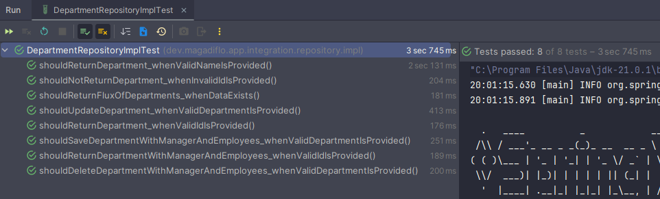
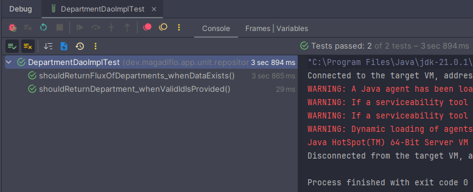

# [Joins with Spring Data R2DBC](https://neilwhite.ca/joins-with-spring-data-r2dbc/)

- [Repositorio del tutorial](https://github.com/neil-writes-code/reactive-spring-demo/tree/main)

---

`Spring Data R2DBC` nos permite escribir código sin bloqueo para interactuar con las bases de datos. A diferencia de los
otros proyectos de `Spring Data`, `Spring Data R2DBC` no es un ORM y tiene algunas limitaciones. **Una de esas
limitaciones es la asignación de combinaciones para entidades.** Esto presenta un desafío para aquellos familiarizados
con `Spring Data JPA`.

> **¿Cómo se escribe código que no bloquee, al mismo tiempo que se unen y mapean entidades complejas?**

## Spring Data R2DBC

Al igual que otros proyectos de `Spring Data`, el objetivo de `Spring Data R2DBC` es facilitar el trabajo con bases de
datos. Para lograrlo de forma reactiva, tuvieron que eliminar muchas funciones. `Spring Data R2DBC` no es un marco ORM
y `no admite joins`.

Para una entidad simple, sin relaciones, `R2DBC` funciona muy bien. Cree una clase de entidad y un `repository` de
soporte.

Cuando se trata de entidades con relaciones, este patrón ya no funciona. Para superar esto, necesitamos crear nuestra
propia implementación de `repository` utilizando `DatabaseClient`.

## Dependencias

````xml
<!--Spring Boo 3.3.3-->
<!--Java 21-->
<dependencies>
    <dependency>
        <groupId>org.springframework.boot</groupId>
        <artifactId>spring-boot-starter-data-r2dbc</artifactId>
    </dependency>
    <dependency>
        <groupId>org.springframework.boot</groupId>
        <artifactId>spring-boot-starter-validation</artifactId>
    </dependency>
    <dependency>
        <groupId>org.springframework.boot</groupId>
        <artifactId>spring-boot-starter-webflux</artifactId>
    </dependency>

    <dependency>
        <groupId>org.postgresql</groupId>
        <artifactId>postgresql</artifactId>
        <scope>runtime</scope>
    </dependency>
    <dependency>
        <groupId>org.postgresql</groupId>
        <artifactId>r2dbc-postgresql</artifactId>
        <scope>runtime</scope>
    </dependency>
    <dependency>
        <groupId>org.projectlombok</groupId>
        <artifactId>lombok</artifactId>
        <optional>true</optional>
    </dependency>
    <dependency>
        <groupId>org.springframework.boot</groupId>
        <artifactId>spring-boot-starter-test</artifactId>
        <scope>test</scope>
    </dependency>
    <dependency>
        <groupId>io.projectreactor</groupId>
        <artifactId>reactor-test</artifactId>
        <scope>test</scope>
    </dependency>
</dependencies>
````

## Las entidades

Utilizaremos dos entidades, un `Employee` básico y un `Department` que tiene dos relaciones diferentes con el
`Employee`.

Si traducimos estas entidades a tablas relacionadas en la base de datos, tendríamos el siguiente esquema.


Para nuestro caso de negocio, diremos lo siguiente:

- Un departamento solo tiene un gerente (manager).
- Un empleado puede ser gerente de un único departamento.
- Un departamento tiene muchos empleados.
- Un empleado solo pertenece a un departamento.

Basándonos en el esquema definido, vamos a crear las instrucciones `DDL` para crear las tablas. Estas instrucciones las
crearemos en el archivo `src/main/resources/schema.sql`.

````sql
CREATE TABLE IF NOT EXISTS employees(
    id BIGSERIAL PRIMARY KEY,
    first_name VARCHAR(255) NOT NULL,
    last_name VARCHAR(255) NOT NULL,
    position VARCHAR(255) NOT NULL,
    is_full_time BOOLEAN NOT NULL
);

CREATE TABLE IF NOT EXISTS departments(
    id BIGSERIAL PRIMARY KEY,
    name VARCHAR(255) NOT NULL UNIQUE
);

CREATE TABLE IF NOT EXISTS department_managers(
    department_id BIGINT,
    employee_id BIGINT,
    CONSTRAINT pk_dm PRIMARY KEY(department_id, employee_id),
    CONSTRAINT fk_departments_dm FOREIGN KEY(department_id) REFERENCES departments(id),
    CONSTRAINT fk_employees_dm FOREIGN KEY(employee_id) REFERENCES employees(id),
    CONSTRAINT uk_department_id_dm UNIQUE(department_id),
    CONSTRAINT uk_employee_id_dm UNIQUE(employee_id)
);

CREATE TABLE IF NOT EXISTS department_employees(
    department_id BIGINT,
    employee_id BIGINT,
    CONSTRAINT pk_de PRIMARY KEY(department_id, employee_id),
    CONSTRAINT fk_departments_de FOREIGN KEY(department_id) REFERENCES departments(id),
    CONSTRAINT fk_employees_de FOREIGN KEY(employee_id) REFERENCES employees(id),
    CONSTRAINT uk_employee_id_de UNIQUE(employee_id)
);
````

Ahora, en el mismo directorio crearemos el archivo `src/main/resources/data.sql` con las instrucciones `DML` para
poblar las tablas.

Es importante notar que las dos primeras líneas, son instrucciones que permiten truncar las tablas principales
`departments` y `employees`, dado que, cada vez que levantemos la aplicación, vamos a volver a poblar las tablas
con los mismos registros. Usar `CASCADE` eliminará todos los datos de las tablas relacionadas.

````sql
TRUNCATE TABLE departments RESTART IDENTITY CASCADE;
TRUNCATE TABLE employees RESTART IDENTITY CASCADE;

INSERT INTO employees(first_name, last_name, position, is_full_time)
VALUES('Carlos', 'Gómez', 'Gerente', true),
('Ana', 'Martínez', 'Desarrollador', true),
('Luis', 'Fernández', 'Diseñador', false),
('María', 'Rodríguez', 'Analista', true),
('José', 'Pérez', 'Soporte', true),
('Laura', 'Sánchez', 'Desarrollador', true),
('Jorge', 'López', 'Analista', false),
('Sofía', 'Díaz', 'Gerente', true),
('Manuel', 'Torres', 'Soporte', true),
('Lucía', 'Morales', 'Diseñador', true),
('Miguel', 'Hernández', 'Desarrollador', true),
('Elena', 'Ruiz', 'Analista', false),
('Pablo', 'Jiménez', 'Desarrollador', true),
('Carmen', 'Navarro', 'Soporte', true),
('Raúl', 'Domínguez', 'Gerente', true),
('Beatriz', 'Vargas', 'Desarrollador', true),
('Francisco', 'Muñoz', 'Soporte', true),
('Marta', 'Ortega', 'Diseñador', false),
('Andrés', 'Castillo', 'Analista', true),
('Isabel', 'Ramos', 'Desarrollador', true);

INSERT INTO departments(name)
VALUES('Recursos Humanos'),
('Tecnología'),
('Finanzas'),
('Marketing'),
('Ventas');

INSERT INTO department_managers(department_id, employee_id)
VALUES(1, 1),  -- Recursos Humanos - Carlos Gómez
(2, 8),  -- Tecnología - Sofía Díaz
(3, 15), -- Finanzas - Raúl Domínguez
(4, 4),  -- Marketing - María Rodríguez
(5, 20); -- Ventas - Isabel Ramos

INSERT INTO department_employees(department_id, employee_id)
VALUES(1, 5),  -- Recursos Humanos - José Pérez
(1, 7),  -- Recursos Humanos - Jorge López
(2, 2),  -- Tecnología - Ana Martínez
(2, 6),  -- Tecnología - Laura Sánchez
(2, 11), -- Tecnología - Miguel Hernández
(2, 13), -- Tecnología - Pablo Jiménez
(2, 20), -- Tecnología - Isabel Ramos
(3, 10), -- Finanzas - Lucía Morales
(4, 18), -- Marketing - Marta Ortega
(4, 12), -- Marketing - Elena Ruiz
(5, 3),  -- Ventas - Luis Fernández
(5, 9),  -- Ventas - Manuel Torres
(5, 14), -- Ventas - Carmen Navarro
(5, 16), -- Ventas - Beatriz Vargas
(5, 17), -- Ventas - Francisco Muñoz
(5, 19); -- Ventas - Andrés Castillo
````

## Configura propiedades de la aplicación

En el `application.yml` agregaremos las siguientes configuraciones. Notar que la base de datos que estamos usando
se llama `db_webflux_r2dbc`. Esta base de datos la crearemos en el siguiente apartado.

````yml
server:
  port: 8080
  error:
    include-message: always

spring:
  application:
    name: webflux-r2dbc-joins
  r2dbc:
    url: r2dbc:postgresql://localhost:5433/db_webflux_r2dbc
    username: magadiflo
    password: magadiflo

logging:
  level:
    dev.magadiflo.app: DEBUG
    io.r2dbc.postgresql.QUERY: DEBUG
    io.r2dbc.postgresql.PARAM: DEBUG
````

## Base de datos Postgres con docker compose

Vamos a crear nuestra base de datos usando `compose` de docker.

````yml
services:
  postgres:
    image: postgres:15.2-alpine
    container_name: c-postgres
    restart: unless-stopped
    environment:
      POSTGRES_DB: db_webflux_r2dbc
      POSTGRES_USER: magadiflo
      POSTGRES_PASSWORD: magadiflo
    ports:
      - '5433:5432'
    volumes:
      - postgres_data:/var/lib/postgresql/data

volumes:
  postgres_data:
    name: postgres_data
````

## Crear esquema de base de datos y poblar tablas

Cada vez que iniciemos la aplicación, se ejecutarán los scripts que estamos definiendo en este `@Bean` de configuración,
de esta manera nos aseguramos de que las tablas de la base de dato siempre estén pobladas al iniciar la aplicación.
Cabe resaltar que aunque el archivo `schema.sql` se ejecute cada vez que se inicie la aplicación, solo se crearán las
tablas una sola vez, dado que colocamos en las instrucciónes `DML` lo siguiente `CREATE TABLE IF NOT EXISTS...`.

````java

@Configuration
public class DatabaseConfig {
    @Bean
    public ConnectionFactoryInitializer initializer(ConnectionFactory connectionFactory) {
        ClassPathResource schemaResource = new ClassPathResource("schema.sql");
        ClassPathResource dataResource = new ClassPathResource("data.sql");
        ResourceDatabasePopulator resourceDatabasePopulator = new ResourceDatabasePopulator(schemaResource, dataResource);

        ConnectionFactoryInitializer initializer = new ConnectionFactoryInitializer();
        initializer.setConnectionFactory(connectionFactory);
        initializer.setDatabasePopulator(resourceDatabasePopulator);
        return initializer;
    }
}
````

## Entidades

A continuación se muestran las dos entidades con las que trabajaremos en este proyecto.

````java

@ToString
@AllArgsConstructor
@NoArgsConstructor
@Builder
@Setter
@Getter
@Table(name = "employees")
public class Employee {
    @Id
    private Long id;
    private String firstName;
    private String lastName;
    private String position;
    @Column("is_full_time")
    private boolean fullTime;

    public static Employee fromRow(Map<String, Object> row) {
        if (row.get("e_id") == null) return null;

        return Employee.builder()
                .id(Long.parseLong(row.get("e_id").toString()))
                .firstName((String) row.get("e_firstName"))
                .lastName((String) row.get("e_lastName"))
                .position((String) row.get("e_position"))
                .fullTime((Boolean) row.get("e_isFullTime"))
                .build();
    }

    public static Employee managerFromRow(Map<String, Object> row) {
        if (row.get("m_id") == null) return null;

        return Employee.builder()
                .id(Long.parseLong(row.get("m_id").toString()))
                .firstName((String) row.get("m_firstName"))
                .lastName((String) row.get("m_lastName"))
                .position((String) row.get("m_position"))
                .fullTime((Boolean) row.get("m_isFullTime"))
                .build();
    }
}
````

````java

@ToString
@AllArgsConstructor
@NoArgsConstructor
@Builder
@Setter
@Getter
@Table(name = "departments")
public class Department {
    @Id
    private Long id;
    private String name;

    private Employee manager;

    @Builder.Default
    private List<Employee> employees = new ArrayList<>();

    public Optional<Employee> getManager() {
        return Optional.ofNullable(this.manager);
    }

    public static Mono<Department> fromRows(List<Map<String, Object>> rows) {
        Map<String, Object> firstRow = rows.getFirst();

        Department department = Department.builder()
                .id(Long.parseLong(firstRow.get("d_id").toString()))
                .name(String.valueOf(firstRow.get("d_name")))
                .manager(Employee.managerFromRow(firstRow))
                .employees(rows.stream()
                        .map(Employee::fromRow)
                        .filter(Objects::nonNull)
                        .toList())
                .build();
        return Mono.just(department);
    }

}
````

`@Builder.Default`, esta anotación se usa junto con la anotación `@Builder` de `Lombok`. Cuando utilizas `@Builder` para
generar un patrón de construcción (builder pattern), las variables de instancia que no son explícitamente establecidas
en el proceso de construcción pueden quedar con valores null. Sin embargo, al usar `@Builder.Default`, le indicas a
Lombok que use el valor por defecto proporcionado si no se establece un valor durante la construcción.

Notarás que estas entidades tienen métodos estáticos para crear objetos a partir de una entrada. Estos son los
resultados sin procesar de una llamada con DatabaseClient. Dado que `Spring Data R2DBC` no asigna estos objetos, tenemos
que escribir la lógica nosotros mismos. `row.get` es nuestro mejor amigo aquí, ya que nos permite extraer cualquier
columna y convertirla al tipo que necesitamos.

## Repositorio

Antes dije que los repositorios estándar son adecuados para entidades sin relaciones. Lo que significa que todo lo que
tenemos que hacer para `Employee` es crear nuestra interfaz que extienda de `R2dbcRepository`. Además, estamos creando
consultas personalizadas usando las convenciones de nombre de método.

````java
public interface EmployeeRepository extends R2dbcRepository<Employee, Long> {
    Flux<Employee> findAllByPosition(String position);

    Flux<Employee> findAllByFullTime(boolean isFullTime);

    Flux<Employee> findAllByPositionAndFullTime(String position, boolean isFullTime);

    Flux<Employee> findByFirstName(String firstName);
}
````

## DAO

Ahora, si revisamos la entidad `Department`, esta entidad está relacionada con `Employee` a través de los atributos
`manager` y `employees`, por lo que crear una interfaz y extenderla de `R2dbcRepository` no es lo adecuado para traer
los datos relacionados.

Lo que haremos en este caso, será crear una interfaz y luego crearemos su propia implementación. Para mantener el mismo
patrón para el `Department`, necesitamos una interfaz y una clase de implementación, `DepartmentDao` y
`DepartmentDaoImpl`.

Entonces, nuestro `DepartmentDao` y `DepartmentDaoImpl` se asemejan más a un patrón `DAO` que a un repositorio
tradicional de `Spring Data`, es por eso que nombro a la interfaz y a su implementación con `dao` y no `repository`.
Estás proporcionando una implementación específica para acceder a datos, en lugar de depender completamente de la
implementación automática proporcionada por `Spring Data`.

````java
public interface DepartmentDao {
    Flux<Department> findAll();

    Mono<Department> findById(Long departmentId);

    Mono<Department> findDepartmentWithManagerAndEmployees(Long departmentId);

    Mono<Department> findByName(String name);

    Mono<Department> save(Department department);

    Mono<Void> delete(Department department);
}
````

Damos a cada columna un alias para utilizar al extraer datos para crear nuestros objetos, como se ve en la siguiente
clase de entidad. `No es necesario utilizar alias`, **pero puede resultar útil si el nombre de una columna no coincide
con el nombre del campo.**

````java

@Slf4j
@RequiredArgsConstructor
@Repository
public class DepartmentDaoImpl implements DepartmentDao {

    private final EmployeeRepository employeeRepository;
    private final DatabaseClient client;
    private static final String SELECT_QUERY = """
            SELECT d.id AS d_id,
                    d.name AS d_name,
                    m.id AS m_id,
                    m.first_name AS m_firstName,
                    m.last_name AS m_lastName,
                    m.position AS m_position,
                    m.is_full_time AS m_isFullTime,
                    e.id AS e_id,
                    e.first_name AS e_firstName,
                    e.last_name AS e_lastName,
                    e.position AS e_position,
                    e.is_full_time AS e_isFullTime
            FROM departments AS d
                LEFT JOIN department_managers AS dm ON(d.id = dm.department_id)
                LEFT JOIN employees AS m ON(dm.employee_id = m.id)
                LEFT JOIN department_employees AS de ON(d.id = de.department_id)
                LEFT JOIN employees AS e ON(de.employee_id = e.id)
            """;

    @Override
    public Flux<Department> findAll() {
        return this.client.sql("%s ORDER BY d.id".formatted(SELECT_QUERY))
                .fetch()
                .all()
                .bufferUntilChanged(rowMap -> rowMap.get("d_id"))
                .flatMap(Department::fromRows);
    }

    @Override
    public Mono<Department> findById(Long departmentId) {
        return this.client.sql("""
                        SELECT id, name
                        FROM departments
                        WHERE id = :departmentId
                        """)
                .bind("departmentId", departmentId)
                .map((row, rowMetadata) -> Department.builder()
                        .id(row.get("id", Long.class))
                        .name(row.get("name", String.class))
                        .build()
                )
                .first();
    }

    @Override
    public Mono<Department> findDepartmentWithManagerAndEmployees(Long departmentId) {
        return this.client.sql("%s WHERE d.id = :departmentId".formatted(SELECT_QUERY))
                .bind("departmentId", departmentId)
                .fetch()
                .all()
                .bufferUntilChanged(result -> result.get("d_id"))
                .flatMap(Department::fromRows)
                .singleOrEmpty();
    }

    @Override
    public Mono<Department> findByName(String name) {
        return this.client.sql("%s WHERE d.name = :name".formatted(SELECT_QUERY))
                .bind("name", name)
                .fetch()
                .all()
                .bufferUntilChanged(result -> result.get("d_id"))
                .flatMap(Department::fromRows)
                .singleOrEmpty();
    }

    @Override
    public Mono<Department> save(Department department) {
        return this.saveDepartment(department)
                .flatMap(this::saveManager)
                .flatMap(this::saveEmployees)
                .flatMap(this::deleteDepartmentManager)
                .flatMap(this::saveDepartmentManager)
                .flatMap(this::deleteDepartmentEmployees)
                .flatMap(this::saveDepartmentEmployees);
    }

    @Override
    public Mono<Void> delete(Department department) {
        return this.deleteDepartmentManager(department)
                .flatMap(this::deleteDepartmentEmployees)
                .flatMap(this::deleteDepartment)
                .then();
    }

    private Mono<Department> saveDepartment(Department department) {
        if (department.getId() == null) {
            return this.client.sql("""
                            INSERT INTO departments(name)
                            VALUES(:name)
                            """)
                    .bind("name", department.getName())
                    .filter((statement, next) -> statement.returnGeneratedValues("id").execute())
                    .fetch()
                    .first()
                    .doOnNext(result -> department.setId(Long.parseLong(result.get("id").toString())))
                    .thenReturn(department);
        }
        return this.client.sql("""
                        UPDATE departments
                        SET name = :name
                        WHERE id = :departmentId
                        """)
                .bind("name", department.getName())
                .bind("departmentId", department.getId())
                .fetch()
                .first()
                .thenReturn(department);
    }

    private Mono<Department> saveManager(Department department) {
        return Mono.justOrEmpty(department.getManager())
                .flatMap(this.employeeRepository::save)
                .doOnNext(department::setManager)
                .thenReturn(department);
    }

    private Mono<Department> saveEmployees(Department department) {
        return Flux.fromIterable(department.getEmployees())
                .flatMap(this.employeeRepository::save)
                .collectList()
                .doOnNext(department::setEmployees)
                .thenReturn(department);
    }

    private Mono<Department> deleteDepartmentManager(Department department) {
        final String QUERY = """
                DELETE FROM department_managers WHERE department_id = :departmentId OR employee_id = :managerId
                """;
        return Mono.just(department)
                .flatMap(dep -> client.sql(QUERY)
                        .bind("departmentId", dep.getId())
                        .bind("managerId", dep.getManager().orElseGet(() -> Employee.builder().id(0L).build()).getId())
                        .fetch()
                        .rowsUpdated())
                .thenReturn(department);
    }

    private Mono<Department> saveDepartmentManager(Department department) {
        final String QUERY = """
                INSERT INTO department_managers(department_id, employee_id)
                VALUES(:departmentId, :employeeId)
                """;

        return Mono.justOrEmpty(department.getManager())
                .flatMap(manager -> client.sql(QUERY)
                        .bind("departmentId", department.getId())
                        .bind("employeeId", manager.getId())
                        .fetch()
                        .rowsUpdated())
                .thenReturn(department);
    }

    private Mono<Department> deleteDepartmentEmployees(Department department) {
        final String QUERY = """
                DELETE FROM department_employees WHERE department_id = :departmentId OR employee_id IN (:employeeIds)
                """;

        List<Long> employeeIds = department.getEmployees().stream().map(Employee::getId).toList();

        return Mono.just(department)
                .flatMap(dep -> client.sql(QUERY)
                        .bind("departmentId", department.getId())
                        .bind("employeeIds", employeeIds.isEmpty() ? List.of(0) : employeeIds)
                        .fetch()
                        .rowsUpdated())
                .thenReturn(department);
    }

    private Mono<Department> saveDepartmentEmployees(Department department) {
        final String QUERY = """
                INSERT INTO department_employees(department_id, employee_id)
                VALUES(:departmentId, :employeeId)
                """;

        return Flux.fromIterable(department.getEmployees())
                .flatMap(employee -> client.sql(QUERY)
                        .bind("departmentId", department.getId())
                        .bind("employeeId", employee.getId())
                        .fetch()
                        .rowsUpdated())
                .collectList()
                .thenReturn(department);
    }

    private Mono<Void> deleteDepartment(Department department) {
        return this.client.sql("DELETE FROM departments WHERE id = :departmentId")
                .bind("departmentId", department.getId())
                .fetch()
                .first()
                .then();
    }
}
````

## Analizando en detalle el método findAll()

````java

@Override
public Flux<Department> findAll() {
    return this.client.sql("%s ORDER BY d.id".formatted(SELECT_QUERY))
            .fetch()
            .all()
            .bufferUntilChanged(rowMap -> rowMap.get("d_id"))
            .flatMap(Department::fromRows);
}
````

**DONDE**

- `this.client`, instancia de `Databaseclient` definido al inicio de la clase.


- `.sql("%s ORDER BY d.id".formatted(SELECT_QUERY))`, especifica una sentencia `SQL` estática para ejecutar.


- `.fetch()`, realice la llamada `SQL` y recupere el resultado ingresando a la etapa de ejecución.


- `.all()`, recupera todos los resultados de la consulta como un `Flux<Map<String, Object>>`, donde cada `Map`
  representa una fila de la base de datos con los nombres de las columnas como claves.


- `.bufferUntilChanged(rowMap -> rowMap.get("d_id"))`, recopilar repeticiones subsiguientes de un elemento (es decir, si
  llegan inmediatamente una después de la otra), comparadas con una clave extraída a través de la función proporcionada
  por el usuario, en múltiples buffers de lista que serán emitidos por el flujo resultante. En otras palabras, El método
  `bufferUntilChanged()` agrupa las filas devueltas por la consulta basándose en el cambio del valor de la clave `d_id`.
  El valor `rowMap.get("d_id")` extrae el valor de la columna `d_id` de cada fila. Cada vez que cambia el valor de
  `d_id`, se inicia un nuevo grupo de filas. Esto es útil si tienes varias filas relacionadas que comparten el mismo
  valor de `d_id` y deseas agruparlas antes de mapearlas a un objeto de dominio. Entonces, el `bufferUntilChanged()` va
  a ir recibiendo fila tras fila y va a ir verificando que el `d_id` sea el mismo para poder agruparlos en una misma
  lista. Si en seguida viene un `d_id` distinto, procede a retornar la lista que tenía agrupada para iniciar un nuevo
  grupo con el nuevo `d_id` obtenido. Este método retorna un `Flux<List<Map<String, Object>>>`.


- `.flatMap(Department::fromRows)`, toma cada grupo de filas (representado como un `List<Map<String, Object>>`) y
  utiliza el método estático `fromRows` de la clase `Department` para convertirlo en un objeto `Department`. El método
  `fromRows` debe estar diseñado para construir un objeto `Department` a partir de un conjunto de filas relacionadas.

### Probando ejecución del método findAll()

Antes de ver el comportamiento del método `findAll()` vamos a agregar unos logs para ver el resultado que va fluyendo
por los operadores.

````java

@Override
public Flux<Department> findAll() {
    return this.client.sql("%s ORDER BY d.id".formatted(SELECT_QUERY))
            .fetch()
            .all()
            .doOnNext(rowMap -> {
                log.info(rowMap.toString());
            })
            .bufferUntilChanged(rowMap -> rowMap.get("d_id"))
            .doOnNext(listRowsMap -> {
                log.debug(listRowsMap.toString());
            })
            .flatMap(Department::fromRows);
}
````

Ahora sí, realizamos una petición al endpoint para poder listar los departamentos y este es parte del resultado que
obtenemos en la consola del ide.

````bash
 INFO DepartmentDaoImpl    : {d_id=1, d_name=Recursos Humanos, m_id=1, m_firstname=Carlos, m_lastname=Gómez, m_position=Gerente, m_isfulltime=true, e_id=5, e_firstname=José, e_lastname=Pérez, e_position=Soporte, e_isfulltime=true}
 INFO DepartmentDaoImpl    : {d_id=1, d_name=Recursos Humanos, m_id=1, m_firstname=Carlos, m_lastname=Gómez, m_position=Gerente, m_isfulltime=true, e_id=7, e_firstname=Jorge, e_lastname=López, e_position=Analista, e_isfulltime=false}
 INFO DepartmentDaoImpl    : {d_id=2, d_name=Tecnología, m_id=8, m_firstname=Sofía, m_lastname=Díaz, m_position=Gerente, m_isfulltime=true, e_id=2, e_firstname=Ana, e_lastname=Martínez, e_position=Desarrollador, e_isfulltime=true}
DEBUG DepartmentDaoImpl    : [{d_id=1, d_name=Recursos Humanos, m_id=1, m_firstname=Carlos, m_lastname=Gómez, m_position=Gerente, m_isfulltime=true, e_id=5, e_firstname=José, e_lastname=Pérez, e_position=Soporte, e_isfulltime=true}, {d_id=1, d_name=Recursos Humanos, m_id=1, m_firstname=Carlos, m_lastname=Gómez, m_position=Gerente, m_isfulltime=true, e_id=7, e_firstname=Jorge, e_lastname=López, e_position=Analista, e_isfulltime=false}]
 INFO DepartmentDaoImpl    : {d_id=2, d_name=Tecnología, m_id=8, m_firstname=Sofía, m_lastname=Díaz, m_position=Gerente, m_isfulltime=true, e_id=6, e_firstname=Laura, e_lastname=Sánchez, e_position=Desarrollador, e_isfulltime=true}
 INFO DepartmentDaoImpl    : {d_id=2, d_name=Tecnología, m_id=8, m_firstname=Sofía, m_lastname=Díaz, m_position=Gerente, m_isfulltime=true, e_id=11, e_firstname=Miguel, e_lastname=Hernández, e_position=Desarrollador, e_isfulltime=true}
 INFO DepartmentDaoImpl    : {d_id=2, d_name=Tecnología, m_id=8, m_firstname=Sofía, m_lastname=Díaz, m_position=Gerente, m_isfulltime=true, e_id=13, e_firstname=Pablo, e_lastname=Jiménez, e_position=Desarrollador, e_isfulltime=true}
 INFO DepartmentDaoImpl    : {d_id=2, d_name=Tecnología, m_id=8, m_firstname=Sofía, m_lastname=Díaz, m_position=Gerente, m_isfulltime=true, e_id=20, e_firstname=Isabel, e_lastname=Ramos, e_position=Desarrollador, e_isfulltime=true}
 INFO DepartmentDaoImpl    : {d_id=3, d_name=Finanzas, m_id=15, m_firstname=Raúl, m_lastname=Domínguez, m_position=Gerente, m_isfulltime=true, e_id=10, e_firstname=Lucía, e_lastname=Morales, e_position=Diseñador, e_isfulltime=true}
DEBUG DepartmentDaoImpl    : [{d_id=2, d_name=Tecnología, m_id=8, m_firstname=Sofía, m_lastname=Díaz, m_position=Gerente, m_isfulltime=true, e_id=2, e_firstname=Ana, e_lastname=Martínez, e_position=Desarrollador, e_isfulltime=true}, {d_id=2, d_name=Tecnología, m_id=8, m_firstname=Sofía, m_lastname=Díaz, m_position=Gerente, m_isfulltime=true, e_id=6, e_firstname=Laura, e_lastname=Sánchez, e_position=Desarrollador, e_isfulltime=true}, {d_id=2, d_name=Tecnología, m_id=8, m_firstname=Sofía, m_lastname=Díaz, m_position=Gerente, m_isfulltime=true, e_id=11, e_firstname=Miguel, e_lastname=Hernández, e_position=Desarrollador, e_isfulltime=true}, {d_id=2, d_name=Tecnología, m_id=8, m_firstname=Sofía, m_lastname=Díaz, m_position=Gerente, m_isfulltime=true, e_id=13, e_firstname=Pablo, e_lastname=Jiménez, e_position=Desarrollador, e_isfulltime=true}, {d_id=2, d_name=Tecnología, m_id=8, m_firstname=Sofía, m_lastname=Díaz, m_position=Gerente, m_isfulltime=true, e_id=20, e_firstname=Isabel, e_lastname=Ramos, e_position=Desarrollador, e_isfulltime=true}]
 INFO DepartmentDaoImpl    : {d_id=4, d_name=Marketing, m_id=4, m_firstname=María, m_lastname=Rodríguez, m_position=Analista, m_isfulltime=true, e_id=18, e_firstname=Marta, e_lastname=Ortega, e_position=Diseñador, e_isfulltime=false}
DEBUG DepartmentDaoImpl    : [{d_id=3, d_name=Finanzas, m_id=15, m_firstname=Raúl, m_lastname=Domínguez, m_position=Gerente, m_isfulltime=true, e_id=10, e_firstname=Lucía, e_lastname=Morales, e_position=Diseñador, e_isfulltime=true}]
 INFO DepartmentDaoImpl    : {d_id=4, d_name=Marketing, m_id=4, m_firstname=María, m_lastname=Rodríguez, m_position=Analista, m_isfulltime=true, e_id=12, e_firstname=Elena, e_lastname=Ruiz, e_position=Analista, e_isfulltime=false}
 INFO DepartmentDaoImpl    : {d_id=5, d_name=Ventas, m_id=20, m_firstname=Isabel, m_lastname=Ramos, m_position=Desarrollador, m_isfulltime=true, e_id=3, e_firstname=Luis, e_lastname=Fernández, e_position=Diseñador, e_isfulltime=false}
DEBUG DepartmentDaoImpl    : [{d_id=4, d_name=Marketing, m_id=4, m_firstname=María, m_lastname=Rodríguez, m_position=Analista, m_isfulltime=true, e_id=18, e_firstname=Marta, e_lastname=Ortega, e_position=Diseñador, e_isfulltime=false}, {d_id=4, d_name=Marketing, m_id=4, m_firstname=María, m_lastname=Rodríguez, m_position=Analista, m_isfulltime=true, e_id=12, e_firstname=Elena, e_lastname=Ruiz, e_position=Analista, e_isfulltime=false}]
 INFO DepartmentDaoImpl    : {d_id=5, d_name=Ventas, m_id=20, m_firstname=Isabel, m_lastname=Ramos, m_position=Desarrollador, m_isfulltime=true, e_id=9, e_firstname=Manuel, e_lastname=Torres, e_position=Soporte, e_isfulltime=true}
 INFO DepartmentDaoImpl    : {d_id=5, d_name=Ventas, m_id=20, m_firstname=Isabel, m_lastname=Ramos, m_position=Desarrollador, m_isfulltime=true, e_id=14, e_firstname=Carmen, e_lastname=Navarro, e_position=Soporte, e_isfulltime=true}
 INFO DepartmentDaoImpl    : {d_id=5, d_name=Ventas, m_id=20, m_firstname=Isabel, m_lastname=Ramos, m_position=Desarrollador, m_isfulltime=true, e_id=16, e_firstname=Beatriz, e_lastname=Vargas, e_position=Desarrollador, e_isfulltime=true}
 INFO DepartmentDaoImpl    : {d_id=5, d_name=Ventas, m_id=20, m_firstname=Isabel, m_lastname=Ramos, m_position=Desarrollador, m_isfulltime=true, e_id=17, e_firstname=Francisco, e_lastname=Muñoz, e_position=Soporte, e_isfulltime=true}
 INFO DepartmentDaoImpl    : {d_id=5, d_name=Ventas, m_id=20, m_firstname=Isabel, m_lastname=Ramos, m_position=Desarrollador, m_isfulltime=true, e_id=19, e_firstname=Andrés, e_lastname=Castillo, e_position=Analista, e_isfulltime=true}
DEBUG DepartmentDaoImpl    : [{d_id=5, d_name=Ventas, m_id=20, m_firstname=Isabel, m_lastname=Ramos, m_position=Desarrollador, m_isfulltime=true, e_id=3, e_firstname=Luis, e_lastname=Fernández, e_position=Diseñador, e_isfulltime=false}, {d_id=5, d_name=Ventas, m_id=20, m_firstname=Isabel, m_lastname=Ramos, m_position=Desarrollador, m_isfulltime=true, e_id=9, e_firstname=Manuel, e_lastname=Torres, e_position=Soporte, e_isfulltime=true}, {d_id=5, d_name=Ventas, m_id=20, m_firstname=Isabel, m_lastname=Ramos, m_position=Desarrollador, m_isfulltime=true, e_id=14, e_firstname=Carmen, e_lastname=Navarro, e_position=Soporte, e_isfulltime=true}, {d_id=5, d_name=Ventas, m_id=20, m_firstname=Isabel, m_lastname=Ramos, m_position=Desarrollador, m_isfulltime=true, e_id=16, e_firstname=Beatriz, e_lastname=Vargas, e_position=Desarrollador, e_isfulltime=true}, {d_id=5, d_name=Ventas, m_id=20, m_firstname=Isabel, m_lastname=Ramos, m_position=Desarrollador, m_isfulltime=true, e_id=17, e_firstname=Francisco, e_lastname=Muñoz, e_position=Soporte, e_isfulltime=true}, {d_id=5, d_name=Ventas, m_id=20, m_firstname=Isabel, m_lastname=Ramos, m_position=Desarrollador, m_isfulltime=true, e_id=19, e_firstname=Andrés, e_lastname=Castillo, e_position=Analista, e_isfulltime=true}]
````

Como se observa, el operador `all()` va emitiendo uno a uno los resultados de la consulta, eso lo podemos ver en el
log `INFO`.

El operador `bufferUntilChanged()`, obtiene la fila emitida por el operador `all()`. Internamente, se extrae el valor de
la columna `d_id`, será el criterio por el cual agrupará todas las filas que le lleguen. Si extrae un valor distinto al
que ya había extraído anteriormente, lo que hace el operador `bufferUntilChanged()` es seguir con el flujo emitiendo un
`Flux<List<Map<String, Object>>>` que contiene las filas agrupadas por el `d_id`. Eso es lo que observamos en el log
`DEBUG`.

## Analizando en detalle el método findById()

````java

@Override
public Mono<Department> findById(Long departmentId) {
    return this.client.sql("""
                    SELECT id, name
                    FROM departments
                    WHERE id = :departmentId
                    """)
            .bind("departmentId", departmentId)
            .map((row, rowMetadata) -> Department.builder()
                    .id(row.get("id", Long.class))
                    .name(row.get("name", String.class))
                    .build()
            )
            .first();
}
````

**DONDE**

- `this.client.sql(...)`, utiliza el `DatabaseClient` inyectado para ejecutar la consulta `SQL`. `DatabaseClient` es una
  alternativa reactiva a `JdbcTemplate` en `Spring Data R2DBC`.


- `.bind("departmentId", departmentId)`, este método enlaza el valor del parámetro departmentId a la variable :
  departmentId utilizada en la consulta SQL. Esto es necesario para reemplazar el parámetro nombrado con el valor real
  proporcionado por el usuario o el sistema.


- `.map((row, rowMetadata) -> ...)`, configurar una función de mapeo de resultados e `ingresar a la etapa de ejecución`.
  El parámetro es un `mappingFunction`, una función que mapea desde `Row` y `RowMetadata` al tipo de resultado. Retorna
  un `RowsFetchSpec` para configurar qué buscar.


- `.first()`, obtiene el primer resultado o ningún resultado. Retorna un `Mono` que emite el primer elemento o un
  `Mono.empty()` si no se encuentra ninguna coincidencia.

El método `findById()`, lo hubiéramos podido realizar tal como hicimos el `findAll()`, es decir, de esta manera:

````java

@Override
public Mono<Department> findById(Long departmentId) {
    return this.client.sql("""
                    SELECT id, name
                    FROM departments
                    WHERE id = :departmentId
                    """)
            .bind("departmentId", departmentId)
            .fetch()
            .one()
            .map(rowMap -> Department.builder()
                    .id(Long.parseLong(rowMap.get("id").toString()))
                    .name(String.valueOf(rowMap.get("name")))
                    .build());
}
````

Pero aquí, después del `.bind()` estamos usando el `.fetch()`, luego el operador `.one()` y finalmente el
`.map()` para realizar la conversión. Lo distinto aquí es que en este `.map()` estamos recibiendo un
`Map<String, Object>>` y luego parsear el tipo de dato, mientras que en la primera forma que usamos con el
`.map().first()`, allí recibimos un `mappingFunction` con el que podemos parsear directamente, tal como se ve
a continuación `row.get("id", Long.class)`. Así que esta segunda forma lo coloco solo para tenerlo presente.

## Persistiendo entidades

Recuperar una entidad es sencillo: se solicitan algunos datos y se crea un objeto a partir de ellos. Pero, ¿qué sucede
si queremos conservar los datos? Debemos conservar el departamento, el gerente, el empleado y una lista de empleados.
No compartiré todo el código para esto, ya que es bastante largo, pero explicaré la idea de cómo funciona.

La forma más sencilla de comprender la conservación de estas entidades es mediante una `cadena de pasos`.
Para nuestras entidades de ejemplo, se vería así:

- Guardar o actualizar el `Department`
- Guardar o actualizar el gerente (manager) `Employee`
- Guardar o actualizar cada empleado
- Actualizar la relación entre el `Department` y `Manager`
- Actualizar la relación entre el `Department` y `Employee`

El método público se ve exactamente como el siguiente código

````java

@Override
public Mono<Department> save(Department department) {
    return this.saveDepartment(department)
            .flatMap(this::saveManager)
            .flatMap(this::saveEmployees)
            .flatMap(this::deleteDepartmentManager)
            .flatMap(this::saveDepartmentManager)
            .flatMap(this::deleteDepartmentEmployees)
            .flatMap(this::saveDepartmentEmployees);
}
````

Pasamos el `Department` inicial por cada paso, modificando el estado a medida que avanzamos.

A continuación se muestra el primer paso de este proceso: `saveDepartment`.

````java
private Mono<Department> saveDepartment(Department department) {
    if (department.getId() == null) {
        return this.client.sql("""
                        INSERT INTO departments(name)
                        VALUES(:name)
                        """)
                .bind("name", department.getName())
                .filter((statement, next) -> statement.returnGeneratedValues("id").execute())
                .fetch()
                .first()
                .doOnNext(result -> department.setId(Long.parseLong(result.get("id").toString())))
                .thenReturn(department);
    }
    return this.client.sql("""
                    UPDATE departments
                    SET name = :name
                    WHERE id = :departmentId
                    """)
            .bind("name", department.getName())
            .bind("departmentId", department.getId())
            .fetch()
            .first()
            .thenReturn(department);
}
````

Vemos que hay dos ramas, una para persistir una nueva entidad y otra para actualizarla. En la primera, usamos nuestro
cliente para insertar un nuevo `Department`, devolviendo un `id`. Luego, establecemos el `id` de nuestro objeto
`Department` antes de devolverlo para el siguiente paso. Cada paso posterior hará lo mismo, persistirá una entidad y la
establecerá nuevamente como nuestra entidad principal.

Una vez que se haya persistido el `Department`, podemos pasar a las otras entidades anidadas. Cada entidad anidada
requiere tres pasos, que verá a continuación para el administrador del departamento.

Primero persistimos el administrador. El uso de `EmployeeRepository` facilita esto, ya que no tenemos que decidir entre
una inserción o una actualización como lo hacemos con el `Department`. Una vez que se persiste, establecemos el objeto
de administrador del Departamento en el Empleado nuevo/actualizado.

````java
private Mono<Department> saveManager(Department department) {
    return Mono.justOrEmpty(department.getManager())
            .flatMap(this.employeeRepository::save)
            .doOnNext(department::setManager)
            .thenReturn(department);
}
````

Una vez que se ha conservado la entidad, queremos conservar la relación entre el departamento y el empleado. Primero
debemos eliminar cualquier relación existente.

````java
private Mono<Department> deleteDepartmentManager(Department department) {
    final String QUERY = """
            DELETE FROM department_managers WHERE department_id = :departmentId OR employee_id = :managerId
            """;
    return Mono.just(department)
            .flatMap(dep -> client.sql(QUERY)
                    .bind("departmentId", dep.getId())
                    .bind("managerId", dep.getManager().orElseGet(() -> Employee.builder().id(0L).build()).getId())
                    .fetch()
                    .rowsUpdated())
            .thenReturn(department);
}
````

Luego, debemos mantener la nueva relación. Una característica útil de `Mono` es que devuelve de `0 a 1` objetos, por lo
que si el `manager` está vacío, no se llama a `.flatMap` y pasamos a devolver el `Department` al final del método.

````java
private Mono<Department> saveDepartmentManager(Department department) {
    final String QUERY = """
            INSERT INTO department_managers(department_id, employee_id)
            VALUES(:departmentId, :employeeId)
            """;

    return Mono.justOrEmpty(department.getManager())
            .flatMap(manager -> client.sql(QUERY)
                    .bind("departmentId", department.getId())
                    .bind("employeeId", manager.getId())
                    .fetch()
                    .rowsUpdated())
            .thenReturn(department);
}
````

Para resumir, persistimos nuestro `Department`, persistimos cualquier entidad anidada `(Empleado)` y luego creamos una
relación entre los dos.

## DTOs

````java
public record CreateEmployeeRequest(@NotBlank
                                    String firstName,

                                    @NotBlank
                                    String lastName,

                                    @NotBlank
                                    String position,

                                    @NotNull
                                    Boolean isFullTime) {
}
````

````java
public record CreateDepartmentRequest(@NotBlank
                                      String name) {
}
````

````java

@ToString
@AllArgsConstructor
@NoArgsConstructor
@Builder
@Setter
@Getter
@JsonInclude(JsonInclude.Include.NON_NULL)
public class DepartmentResponse {
    private Long id;
    private String name;
    private Employee manager;
    private List<Employee> employees;
}
````

## Excepciones

````java
public class EmployeeNotFoundException extends RuntimeException {
    public EmployeeNotFoundException(Long employeeId) {
        super("El empleado con id %d no fue encontrado".formatted(employeeId));
    }
}
````

````java
public class DepartmentNotFoundException extends RuntimeException {
    public DepartmentNotFoundException(Long departmentId) {
        super("El departamento con id %d no fue encontrado".formatted(departmentId));
    }
}
````

````java
public class DepartmentAlreadyExistsException extends RuntimeException {
    public DepartmentAlreadyExistsException(String name) {
        super("El departamento con nombre %s ya existe".formatted(name));
    }
}
````

## Manejo de excepciones

````java
public record ErrorResponse(Map<String, Object> errors) {
}
````

````java

@Slf4j
@RestControllerAdvice
public class GlobalExceptionHandler {

    @ExceptionHandler({
            EmployeeNotFoundException.class,
            DepartmentNotFoundException.class
    })
    public Mono<ResponseEntity<ErrorResponse>> handleNotFoundException(Exception exception) {
        log.debug("handleNotFoundException:: {}", exception.getMessage());
        ErrorResponse response = new ErrorResponse(Map.of("message", exception.getMessage()));
        return Mono.just(ResponseEntity.status(HttpStatus.NOT_FOUND).body(response));
    }

    @ExceptionHandler(DepartmentAlreadyExistsException.class)
    public Mono<ResponseEntity<ErrorResponse>> handleAlreadyExistsException(Exception exception) {
        log.debug("handleAlreadyExistsException:: {}", exception.getMessage());
        ErrorResponse response = new ErrorResponse(Map.of("message", exception.getMessage()));
        return Mono.just(ResponseEntity.status(HttpStatus.BAD_REQUEST).body(response));
    }

    @ExceptionHandler(WebExchangeBindException.class)
    public ResponseEntity<ErrorResponse> handleException(WebExchangeBindException exception) {
        log.debug("webExchangeBindException:: {}", exception.getMessage());
        List<String> errors = exception.getBindingResult()
                .getAllErrors()
                .stream()
                .map(DefaultMessageSourceResolvable::getDefaultMessage)
                .toList();
        ErrorResponse response = new ErrorResponse(Map.of("errors", errors));
        return ResponseEntity.badRequest().body(response);
    }

    @ExceptionHandler(Exception.class)
    public ResponseEntity<ErrorResponse> handleException(Exception exception) {
        log.debug("handleException:: {}", exception.getMessage());
        exception.printStackTrace();
        ErrorResponse response = new ErrorResponse(Map.of("error", exception.getMessage()));
        return ResponseEntity.badRequest().body(response);
    }

}
````

## Servicios

````java
public interface EmployeeService {
    Flux<Employee> getAllEmployees(String position, Boolean isFullTime);

    Mono<Employee> showEmployee(Long employeeId);

    Mono<Employee> createEmployee(CreateEmployeeRequest employeeRequest);

    Mono<Employee> updateEmployee(Long employeeId, Employee employee);

    Mono<Void> deleteEmployee(Long employeeId);
}

````

````java
public interface DepartmentService {
    Flux<Department> getAllDepartments();

    Mono<DepartmentResponse> showDepartment(Long departmentId);

    Mono<Department> showDepartmentWithManagerAndEmployees(Long departmentId);

    Flux<Employee> getEmployeesFromDepartment(Long departmentId, Boolean isFullTime);

    Mono<Department> createDepartment(CreateDepartmentRequest departmentRequest);

    Mono<Department> updateDepartment(Long departmentId, Department department);

    Mono<Void> deleteDepartment(Long departmentId);
}
````

````java

@Slf4j
@RequiredArgsConstructor
@Service
@Transactional(readOnly = true)
public class EmployeeServiceImpl implements EmployeeService {

    private final EmployeeRepository employeeRepository;


    @Override
    public Flux<Employee> getAllEmployees(String position, Boolean isFullTime) {
        if (position == null && isFullTime == null) {
            return this.employeeRepository.findAll();
        }

        if (position != null & isFullTime != null) {
            return this.employeeRepository.findAllByPositionAndFullTime(position, isFullTime);
        }

        if (position != null) {
            return this.employeeRepository.findAllByPosition(position);
        }

        return this.employeeRepository.findAllByFullTime(isFullTime);
    }

    @Override
    public Mono<Employee> showEmployee(Long employeeId) {
        return this.employeeRepository.findById(employeeId)
                .switchIfEmpty(Mono.error(new EmployeeNotFoundException(employeeId)));
    }

    @Override
    @Transactional
    public Mono<Employee> createEmployee(CreateEmployeeRequest employeeRequest) {
        Employee employee = Employee.builder()
                .firstName(employeeRequest.firstName())
                .lastName(employeeRequest.lastName())
                .position(employeeRequest.position())
                .fullTime(employeeRequest.isFullTime())
                .build();
        return this.employeeRepository.save(employee);
    }

    @Override
    @Transactional
    public Mono<Employee> updateEmployee(Long employeeId, Employee employee) {
        return this.employeeRepository.findById(employeeId)
                .switchIfEmpty(Mono.error(new EmployeeNotFoundException(employeeId)))
                .map(employeeDB -> {
                    employeeDB.setFirstName(employee.getFirstName());
                    employeeDB.setLastName(employee.getLastName());
                    employeeDB.setPosition(employee.getPosition());
                    employeeDB.setFullTime(employee.isFullTime());
                    return employeeDB;
                })
                .flatMap(this.employeeRepository::save);
    }

    @Override
    @Transactional
    public Mono<Void> deleteEmployee(Long employeeId) {
        return this.employeeRepository.findById(employeeId)
                .switchIfEmpty(Mono.error(new EmployeeNotFoundException(employeeId)))
                .flatMap(this.employeeRepository::delete)
                .then();
    }
}
````

````java

@Slf4j
@RequiredArgsConstructor
@Service
@Transactional(readOnly = true)
public class DepartmentServiceImpl implements DepartmentService {

    private final DepartmentDao departmentDao;

    @Override
    public Flux<Department> getAllDepartments() {
        return this.departmentDao.findAll();
    }

    @Override
    public Mono<DepartmentResponse> showDepartment(Long departmentId) {
        return this.departmentDao.findById(departmentId)
                .map(departmentDB -> DepartmentResponse.builder()
                        .id(departmentDB.getId())
                        .name(departmentDB.getName())
                        .build())
                .switchIfEmpty(Mono.error(new DepartmentNotFoundException(departmentId)));
    }

    @Override
    public Mono<Department> showDepartmentWithManagerAndEmployees(Long departmentId) {
        return this.departmentDao.findDepartmentWithManagerAndEmployees(departmentId)
                .switchIfEmpty(Mono.error(new DepartmentNotFoundException(departmentId)));
    }

    @Override
    public Flux<Employee> getEmployeesFromDepartment(Long departmentId, Boolean isFullTime) {
        if (isFullTime != null) {
            return this.departmentDao.findDepartmentWithManagerAndEmployees(departmentId)
                    .switchIfEmpty(Mono.error(new DepartmentNotFoundException(departmentId)))
                    .flatMapMany(departmentDB -> {
                        Stream<Employee> employeeStream = departmentDB.getEmployees().stream()
                                .filter(employee -> employee.isFullTime() == isFullTime);
                        return Flux.fromStream(employeeStream);
                    });
        }

        return this.departmentDao.findDepartmentWithManagerAndEmployees(departmentId)
                .switchIfEmpty(Mono.error(new DepartmentNotFoundException(departmentId)))
                .flatMapMany(department -> Flux.fromIterable(department.getEmployees()));
    }

    @Override
    @Transactional
    public Mono<Department> createDepartment(CreateDepartmentRequest departmentRequest) {
        return this.departmentDao.findByName(departmentRequest.name())
                .flatMap(departmentDB -> Mono.error(new DepartmentAlreadyExistsException(departmentRequest.name())))
                .defaultIfEmpty(Department.builder().name(departmentRequest.name()).build())
                .cast(Department.class)
                .flatMap(this.departmentDao::save);
    }

    @Override
    @Transactional
    public Mono<Department> updateDepartment(Long departmentId, Department department) {
        return this.departmentDao.findDepartmentWithManagerAndEmployees(departmentId)
                .switchIfEmpty(Mono.error(new DepartmentNotFoundException(departmentId)))
                .map(departmentDB -> {
                    departmentDB.setName(department.getName());
                    if (department.getManager().isPresent()) {
                        departmentDB.setManager(department.getManager().get());
                    }
                    departmentDB.setEmployees(department.getEmployees());
                    return departmentDB;
                })
                .flatMap(this.departmentDao::save);
    }

    @Override
    @Transactional
    public Mono<Void> deleteDepartment(Long departmentId) {
        return this.departmentDao.findDepartmentWithManagerAndEmployees(departmentId)
                .switchIfEmpty(Mono.error(new DepartmentNotFoundException(departmentId)))
                .flatMap(this.departmentDao::delete);
    }
}
````

## Controladores

````java

@Slf4j
@RequiredArgsConstructor
@RestController
@RequestMapping(path = "/api/v1/employees")
public class EmployeeController {

    private final EmployeeService employeeService;

    @GetMapping
    public Mono<ResponseEntity<Flux<Employee>>> findAllEmployees(@RequestParam(required = false) String position,
                                                                 @RequestParam(name = "fullTime", required = false) Boolean isFullTime) {
        return Mono.just(ResponseEntity.ok(this.employeeService.getAllEmployees(position, isFullTime)));
    }

    @GetMapping(path = "/{employeeId}")
    public Mono<ResponseEntity<Employee>> findEmployee(@PathVariable Long employeeId) {
        return this.employeeService.showEmployee(employeeId)
                .map(ResponseEntity::ok);
    }

    @PostMapping
    public Mono<ResponseEntity<Employee>> saveEmployee(@Valid @RequestBody CreateEmployeeRequest employeeRequest) {
        return this.employeeService.createEmployee(employeeRequest)
                .map(employeeDB -> new ResponseEntity<>(employeeDB, HttpStatus.CREATED));
    }

    @PutMapping(path = "/{employeeId}")
    public Mono<ResponseEntity<Employee>> updateEmployee(@PathVariable Long employeeId, @RequestBody Employee employee) {
        return this.employeeService.updateEmployee(employeeId, employee)
                .map(ResponseEntity::ok);
    }

    @DeleteMapping(path = "/{employeeId}")
    public Mono<ResponseEntity<Void>> deleteEmployee(@PathVariable Long employeeId) {
        return this.employeeService.deleteEmployee(employeeId)
                .thenReturn(ResponseEntity.noContent().build());
    }
}
````

````java

@Slf4j
@RequiredArgsConstructor
@RestController
@RequestMapping(path = "/api/v1/departments")
public class DepartmentController {

    private final DepartmentService departmentService;

    @GetMapping
    public Mono<ResponseEntity<Flux<Department>>> findAllDepartments() {
        return Mono.just(ResponseEntity.ok(this.departmentService.getAllDepartments()));
    }

    @GetMapping(path = "/{departmentId}")
    public Mono<ResponseEntity<DepartmentResponse>> findDepartment(@PathVariable Long departmentId) {
        return this.departmentService.showDepartment(departmentId)
                .map(ResponseEntity::ok);
    }

    @GetMapping(path = "/{departmentId}/manager-employees")
    public Mono<ResponseEntity<Department>> findWithManagerAndEmployees(@PathVariable Long departmentId) {
        return this.departmentService.showDepartmentWithManagerAndEmployees(departmentId)
                .map(ResponseEntity::ok);
    }

    @GetMapping(path = "/{departmentId}/employees")
    public Mono<ResponseEntity<Flux<Employee>>> getEmployeesFromDepartment(@PathVariable Long departmentId,
                                                                           @RequestParam(name = "fullTime", required = false) Boolean isFullTime) {
        return Mono.just(ResponseEntity.ok(this.departmentService.getEmployeesFromDepartment(departmentId, isFullTime)));
    }

    @PostMapping
    public Mono<ResponseEntity<Department>> saveDepartment(@Valid @RequestBody CreateDepartmentRequest request) {
        return this.departmentService.createDepartment(request)
                .map(departmentDB -> new ResponseEntity<>(departmentDB, HttpStatus.CREATED));
    }

    @PutMapping(path = "/{departmentId}")
    public Mono<ResponseEntity<Department>> updateDepartment(@PathVariable Long departmentId, @RequestBody Department department) {
        return this.departmentService.updateDepartment(departmentId, department)
                .map(ResponseEntity::ok);
    }

    @DeleteMapping(path = "/{departmentId}")
    public Mono<ResponseEntity<Void>> deleteDepartment(@PathVariable Long departmentId) {
        return this.departmentService.deleteDepartment(departmentId)
                .thenReturn(ResponseEntity.noContent().build());
    }

}
````

## Ejecutando aplicación y comprobando funcionamiento de endpoints

### Employee

Como parte de la comprobación, solo se ejecutará el método para listar todos los empleados y registrar un empleado, de
esta manera tendremos una idea del funcionamiento del endpoint.

````bash
$ curl -v http://localhost:8080/api/v1/employees | jq
>
< HTTP/1.1 200 OK
< transfer-encoding: chunked
< Content-Type: application/json
<
[
  {
    "id": 1,
    "firstName": "Carlos",
    "lastName": "Gómez",
    "position": "Gerente",
    "fullTime": true
  },
  {...},
  {
    "id": 20,
    "firstName": "Isabel",
    "lastName": "Ramos",
    "position": "Desarrollador",
    "fullTime": true
  }
]
````

````bash
$ curl -v -X POST -H "Content-Type: application/json" -d "{\"firstName\": \"Maria\", \"lastName\": \"Diaz\", \"position\": \"Desarrollador\", \"isFullTime\": false}" http://localhost:8080/api/v1/employees | jq
>
< HTTP/1.1 201 Created
<
{
  "id": 21,
  "firstName": "Maria",
  "lastName": "Diaz",
  "position": "Desarrollador",
  "fullTime": false
}
````

### Department

De la misma manera que se hizo con los employees, aquí también realizaremos unas cuantas peticiones a algunos endpoints
para tener una idea de su funcionamiento.

````bash
$ curl -v http://localhost:8080/api/v1/departments/1 | jq
>
< HTTP/1.1 200 OK
< Content-Type: application/json
<
{
  "id": 1,
  "name": "Recursos Humanos"
}
````

````bash
$ curl -v http://localhost:8080/api/v1/departments/4/manager-employees | jq
>
< HTTP/1.1 200 OK
<
{
  "id": 4,
  "name": "Marketing",
  "manager": {
    "id": 4,
    "firstName": "María",
    "lastName": "Rodríguez",
    "position": "Analista",
    "fullTime": true
  },
  "employees": [
    {
      "id": 18,
      "firstName": "Marta",
      "lastName": "Ortega",
      "position": "Diseñador",
      "fullTime": false
    },
    {
      "id": 12,
      "firstName": "Elena",
      "lastName": "Ruiz",
      "position": "Analista",
      "fullTime": false
    }
  ]
}
````

````bash
$ curl -v -X POST -H "Content-Type: application/json" -d "{\"name\": \"Legal\"}" http://localhost:8080/api/v1/departments | jq
>
< HTTP/1.1 201 Created
<
{
  "id": 6,
  "name": "Legal",
  "manager": null,
  "employees": []
}
````

````bash
$ curl -v -X PUT -H "Content-Type: application/json" -d "{\"name\": \"Legalizado\", \"manager\": {\"firstName\": \"Martin\", \"lastName\": \"Diaz\", \"position\": \"Desarrollador\", \"fullTime\": true}}" http://localhost:8080/api/v1/departments/6 | jq
>
< HTTP/1.1 200 OK
<
{
  "id": 6,
  "name": "Legalizado",
  "manager": {
    "id": 22,
    "firstName": "Martin",
    "lastName": "Diaz",
    "position": "Desarrollador",
    "fullTime": true
  },
  "employees": []
} 
````

---

# Spring Boot Test - Reactor Test

---

## Test de Integración de Repositorios (DataR2dbcTest)

Para la realización de los test a nuestros repositorios con `R2DBC` utilizamos la anotación `@DataR2dbcTest`, lo que en
`Spring Data JPA` sería la anotación `@DataJpaTest`.

### [Auto-configured Data R2DBC Tests](https://docs.spring.io/spring-boot/reference/testing/spring-boot-applications.html#testing.spring-boot-applications.autoconfigured-spring-data-r2dbc)

`@DataR2dbcTest` es similar a `@DataJdbcTest`, pero está destinado a pruebas que utilizan repositorios
`Spring Data R2DBC`. De manera predeterminada, configura una base de datos integrada en memoria, una
`R2dbcEntityTemplate` y repositorios `Spring Data R2DBC`. Los beans `@Component` y `@ConfigurationProperties`
habituales no se escanean cuando se utiliza la anotación `@DataR2dbcTest`, es decir, el escaneo de componentes
se limita a los repositorios y entidades de `R2DBC (@Table)`. `@EnableConfigurationProperties` se puede
utilizar para incluir beans `@ConfigurationProperties`.

**IMPORTANTE**
> De manera predeterminada, los tests de `Data R2DBC no son transaccionales`.

Si prefiere que la prueba se ejecute en una base de datos real, puede usar la anotación `@AutoConfigureTestDatabase`
de la misma manera que para `@DataJpaTest`. (Consulte Pruebas de Data JPA configuradas automáticamente).

## Nuevo contenedor de postgres para ejecución de pruebas

En el archivo `compose.yml` agregaré un nuevo servicio que nos permitirá crear un contenedor de postgres exclusivamente
para la realización de los test.

````yml
# another service
#
services:
  postgres-test:
    image: postgres:15.2-alpine
    container_name: c-postgres-test
    restart: unless-stopped
    environment:
      POSTGRES_DB: db_webflux_r2dbc_test
      POSTGRES_USER: magadiflo
      POSTGRES_PASSWORD: magadiflo
    ports:
      - '5434:5432'
````

## Configura application.yml en test

Vamos a crear el archivo de propiedades `src/test/resources/application.yml` donde configuraremos la conexión a la
base de datos de prueba `db_webflux_r2dbc_test` que hemos creado en el contenedor anterior.

````yml
spring:
  r2dbc:
    url: r2dbc:postgresql://localhost:5434/db_webflux_r2dbc_test
    username: magadiflo
    password: magadiflo

logging:
  level:
    dev.magadiflo.app: DEBUG
    io.r2dbc.postgresql.QUERY: DEBUG
    io.r2dbc.postgresql.PARAM: DEBUG
````

Ahora, el siguiente paso es crear la estructura de las tablas y poblarlas para la realización de los test. En este caso
la configuración será similar a lo que hicimos en el `/main`.

Primero empezamos creando el archivo `src/test/resources/schema.sql`.

````sql
CREATE TABLE IF NOT EXISTS departments(
    id BIGSERIAL PRIMARY KEY,
    name VARCHAR(255) NOT NULL UNIQUE
);

CREATE TABLE IF NOT EXISTS employees(
    id BIGSERIAL PRIMARY KEY,
    first_name VARCHAR(255) NOT NULL,
    last_name VARCHAR(255) NOT NULL,
    position VARCHAR(255) NOT NULL,
    is_full_time BOOLEAN NOT NULL
);

CREATE TABLE IF NOT EXISTS department_managers(
    department_id BIGINT,
    employee_id BIGINT,
    CONSTRAINT pk_dm PRIMARY KEY(department_id, employee_id),
    CONSTRAINT fk_departments_dm FOREIGN KEY(department_id) REFERENCES departments(id),
    CONSTRAINT fk_employees_dm FOREIGN KEY(employee_id) REFERENCES employees(id),
    CONSTRAINT uk_department_id_dm UNIQUE(department_id),
    CONSTRAINT uk_employee_id_dm UNIQUE(employee_id)
);

CREATE TABLE IF NOT EXISTS department_employees(
    department_id BIGINT,
    employee_id BIGINT,
    CONSTRAINT pk_de PRIMARY KEY(department_id, employee_id),
    CONSTRAINT fk_departments_de FOREIGN KEY(department_id) REFERENCES departments(id),
    CONSTRAINT fk_employees_de FOREIGN KEY(employee_id) REFERENCES employees(id),
    CONSTRAINT uk_employee_id_de UNIQUE(employee_id)
);
````

A continuación, creamos el archivo `src/test/resources/data.sql`.

````sql
TRUNCATE TABLE departments RESTART IDENTITY CASCADE;
TRUNCATE TABLE employees RESTART IDENTITY CASCADE;

INSERT INTO departments(name)
VALUES('Tecnología'),
('Ventas'),
('Legal'),
('Soporte');

INSERT INTO employees(first_name, last_name, position, is_full_time)
VALUES('Martín', 'Díaz', 'Gerente', true),
('Katherine', 'Fernández', 'Desarrollador', true),
('Vanessa', 'Bello', 'Diseñador', false),
('Melissa', 'Peralta', 'Gerente', true),
('Alexander', 'Villanueva', 'Vendedor', true),
('Lizbeth', 'Gonzales', 'Teacher', true),
('Jorge', 'Gayoso', 'Teacher', true);

INSERT INTO department_managers(department_id, employee_id)
VALUES(1, 1),
(2, 4);

INSERT INTO department_employees(department_id, employee_id)
VALUES(1, 2),
(1,3),
(2,5);
````

Ahora sí, viene la configuración que mencionaba, crearemos un `@Bean` que nos permitirá ejecutar los dos scripts
anteriormente mostrados. Esta configuración la crearemos en
`src/test/java/dev/magadiflo/app/config/TestDatabaseConfig.java`.

````java

@TestConfiguration
public class TestDatabaseConfig {
    @Bean
    public ConnectionFactoryInitializer initializer(ConnectionFactory connectionFactory) {
        ClassPathResource schemaResource = new ClassPathResource("schema.sql");
        ClassPathResource dataResource = new ClassPathResource("data.sql");
        ResourceDatabasePopulator resourceDatabasePopulator = new ResourceDatabasePopulator(schemaResource, dataResource);

        ConnectionFactoryInitializer initializer = new ConnectionFactoryInitializer();
        initializer.setConnectionFactory(connectionFactory);
        initializer.setDatabasePopulator(resourceDatabasePopulator);
        return initializer;
    }
}
````

`@TestConfiguration`, internamente, tiene la anotación `@Configuration`. El `@TestConfiguration` se puede utilizar
para definir beans adicionales o personalizaciones para una prueba. A diferencia de las clases `@Configuration`
habituales, el uso de `@TestConfiguration` no impide la detección automática de `@SpringBootConfiguration`.

La anotación `@TestConfiguration` indica que la clase contiene definiciones de beans que son específicas para el entorno
de pruebas. Esto significa que los beans definidos en esta clase solo estarán disponibles en el contexto de prueba y no
afectarán a la configuración de la aplicación principal.

Al usar `@TestConfiguration`, puedes definir beans que solo serán utilizados durante las pruebas, lo que ayuda a
mantener un aislamiento adecuado entre el código de producción y el código de prueba.

La clase `TestDatabaseConfig` contiene un método que devuelve un `ConnectionFactoryInitializer`, que se utiliza para
inicializar la base de datos de prueba. Aquí hay una descripción de los componentes:

- `ConnectionFactoryInitializer`:
    - Se utiliza para inicializar la base de datos con un esquema y datos específicos.
    - Se configura con un `ConnectionFactory`, que es responsable de establecer conexiones a la base de datos.

- `ResourceDatabasePopulator`:
    - Este objeto se encarga de ejecutar scripts SQL (en este caso, `schema.sql` y `data.sql`) para crear y
      poblar la base de datos.
    - Los archivos `schema.sql` y `data.sql` deben estar en el classpath del proyecto, y se ejecutarán al
      iniciar el contexto de prueba.

## Clase de prueba para el repositorio EmployeeRepository

A continuación mostraré la prueba de integración realizada al repositorio `EmployeeRepository`. Recordar que en estas
pruebas estarémos trabajando con una nueva base de datos de `postgres`, misma que definimos en el archivo `compose.yml`.

````java

@DataR2dbcTest
@ContextConfiguration(classes = {TestDatabaseConfig.class})
class EmployeeRepositoryTest {

    @Autowired
    private EmployeeRepository employeeRepository;

    @Autowired
    private DatabaseClient databaseClient;

    private static String DATA_SQL;

    @BeforeAll
    static void beforeAll() throws IOException {
        Path dataPath = Paths.get("src/test/resources/data.sql");
        byte[] readData = Files.readAllBytes(dataPath);
        DATA_SQL = new String(readData);
    }

    @BeforeEach
    void setUp() {
        this.databaseClient.sql(DATA_SQL)
                .fetch()
                .rowsUpdated()
                .block();
    }

    @Test
    void shouldFindAllEmployees() {
        this.employeeRepository.findAll()
                .as(StepVerifier::create)
                .expectNextCount(7)
                .verifyComplete();
    }

    @Test
    void shouldFindAnEmployee() {
        this.employeeRepository.findById(6L)
                .as(StepVerifier::create)
                .consumeNextWith(employeeDB -> {
                    assertThat(employeeDB.getFirstName()).isEqualTo("Lizbeth");
                    assertThat(employeeDB.getLastName()).isEqualTo("Gonzales");
                    assertThat(employeeDB.getPosition()).isEqualTo("Teacher");
                    assertThat(employeeDB.isFullTime()).isTrue();
                })
                .verifyComplete();
    }

    @Test
    void shouldDoesNotReturnEmployeeWithIdThatDoesNotExist() {
        this.employeeRepository.findById(100L)
                .as(StepVerifier::create)
                .expectNextCount(0)
                .verifyComplete();
    }

    @Test
    void shouldFindAllEmployeeByPosition() {
        // given
        String position = "Gerente";

        // when
        Flux<Employee> employeesByPosition = this.employeeRepository.findAllByPosition(position);

        // then
        StepVerifier.create(employeesByPosition)
                .expectNextMatches(employee -> employee.getId().equals(1L))
                .expectNextMatches(employee -> employee.getId().equals(4L))
                .verifyComplete();
    }

    @Test
    void shouldFindAllEmployeesByFullTime() {
        Flux<Employee> employeesByFullTime = this.employeeRepository.findAllByFullTime(false);

        StepVerifier.create(employeesByFullTime)
                .assertNext(employee -> {
                    assertThat(employee.getId()).isEqualTo(3L);
                    assertThat(employee.getFirstName()).isEqualTo("Vanessa");
                    assertThat(employee.getLastName()).isEqualTo("Bello");
                    assertThat(employee.isFullTime()).isEqualTo(false);
                })
                .verifyComplete();
    }

    @Test
    void shouldFindAllEmployeesByPositionAndFullTime() {
        Flux<Employee> employeesByFullTime = this.employeeRepository.findAllByPositionAndFullTime("Teacher", true);

        StepVerifier.create(employeesByFullTime)
                .expectNextCount(2)
                .verifyComplete();
    }

    @Test
    void shouldFindAllEmployeesByFirstName() {
        // given

        // when
        Flux<Employee> employeeFlux = this.employeeRepository.findByFirstName("Katherine");

        // then
        StepVerifier.create(employeeFlux)
                .expectNextCount(1)
                .verifyComplete();
    }

    @Test
    void shouldSaveAnEmployee() {
        // given
        Employee employee = Employee.builder()
                .firstName("Pepe")
                .lastName("Menis")
                .position("Animador")
                .fullTime(true)
                .build();

        // when
        Mono<Employee> employeeMono = this.employeeRepository.save(employee);

        // then
        StepVerifier.create(employeeMono)
                .assertNext(employeeDB -> {
                    assertThat(employeeDB.getId()).isNotNull();
                    assertThat(employeeDB).isEqualTo(employee);
                })
                .verifyComplete();
    }

    @Test
    void shouldDeleteAnEmployee() {
        // given
        this.employeeRepository.findById(6L)
                .as(StepVerifier::create)
                .expectNextCount(1)
                .verifyComplete();

        // when
        this.employeeRepository.deleteById(6L).block();

        // then
        this.employeeRepository.findById(6L)
                .as(StepVerifier::create)
                .expectNextCount(0)
                .verifyComplete();
    }
}
````

Notar que nuestra clase de prueba tiene anotaciones y configuraciones que explicaré a continuación:

`@DataR2dbcTest`, como se mencionó al inicio de este apartado de test, esta anotación se usa para probar repositorios
con `R2DBC` sin cargar todas las configuraciones. Por lo que esta anotación está diseñada para proporcionar una
configuración de prueba `R2DBC`, pero no incluye automáticamente clases de configuración que no están en el contexto de
prueba por defecto.

Por lo tanto, si queremos que la clase de configuración `TestDatabaseConfig` se aplique al contexto de prueba, para que
ejecute las configuraciones que tiene definido y cree las tablas y las rellene, entonces necesitamos agregar una
anotación a nuestra clase de prueba indicándole que usará las configuraciones de la clase `TestDatabaseConfig`. La
anotación a usar será `@ContextConfiguration`.

La anotación `@ContextConfiguration(classes = {TestDatabaseConfig.class})` se utiliza en el contexto de pruebas de
Spring para definir y configurar el contexto de la aplicación que se utilizará durante la ejecución de las pruebas.
Carga los beans y configuraciones definidos en `TestDatabaseConfig`, lo que significa que cualquier bean que hayas
definido allí estará disponible para ser usado en tus pruebas.

La anotación `@DataR2dbcTest` es adecuada para realizar pruebas enfocadas en la capa de datos (repositorios). Esta
anotación automáticamente configura una base de datos en memoria, pero en tu caso, la sobreescribes con tu propia
configuración de base de datos proporcionada por `TestDatabaseConfig`.

En las pruebas también hacemos uso del `DatabaseClient`. Esta interfaz nos permitirá realizar llamadas a la base de
datos. En nuestro caso, lo usamos para ejecutar la consulta definida en el `@BeforeEach`.

Con respecto al método anotado con `@BeforeEach`, lo usamos para poder reiniciar los registros y tener las tablas en
un mismo estado para todos los test que se ejecuten. Esto lo hacemos para que cada método test sea independiente y
la ejecución de un método test no afecte a otros. Además, es importante recordar que hacemos esto, porque
los test de `Data R2DBC no son transaccionales`, mientras que los tests de `@DataJpaTest` sí lo son, por eso es que
tenemos que hacer algo de trabajo extra en este caso.

Es importante notar que también estamos haciendo uso de la anotación de JUnit `@BeforeAll` sobre un método. Este método
nos permitirá ejecutar su contenido una sola vez antes de que se ejecuten todas las pruebas en la clase. Esto es útil
para preparar el entorno de la base de datos antes de todas las pruebas, sin necesidad de repetir la misma configuración
antes de cada prueba.

Aunque `@BeforeAll` carga el archivo `data.sql` una vez, aún necesitas ejecutar el script SQL antes de cada prueba para
restablecer el estado de la base de datos. Por lo tanto, en `@BeforeEach`, usamos el contenido cargado de `DATA_SQL`
para inicializar la base de datos antes de cada prueba.

`StepVerifier`, utilizamos `StepVerifier` como una ayuda de prueba para verificar nuestras expectativas con respecto a
los resultados. `StepVerifier` es una herramienta que permite verificar el comportamiento de flujos reactivos (como
`Flux` o `Mono`).

Ahora, ejecutamos las pruebas y vemos que todas pasan correctamente.


## Clase de prueba para el dao DepartmentDaoImpl

En esta clase de test `DepartmentDaoImplTest` es importante señalar que no se está haciendo uso de la anotación
`@DataR2dbcTest`, dado que esta anotación es especializada para pruebas de repositorios `R2DBC`. Pero para nuestro caso,
como vamos a probar la clase
`DepartmentDaoImpl` necesitamos agregarlo al contexto de la aplicación para que en la clase
`DepartmentDaoImplTest` se pueda inyectar y ejecutar sin problemas. Entonces, la anotación `@DataR2dbcTest`
nos queda corto, ya que solo configura los componentes necesarios para probar repositorios que usan `R2DBC`. No carga
los componentes y configuraciones que no son directamente necesarios para las pruebas de `R2DBC`.

En ese sentido, estamos optando por usar la anotación `@SpringBootTest` que es propio para pruebas de integración y que
nos ayuda a cargar todo el contexto de la aplicación de `Spring Boot`.

A continuación se muestra parte de la implementación del test de integración para la clase `DepartmentDaoImpl`.

````java

@SpringBootTest
class DepartmentDaoImplTest {

    @Autowired
    private DepartmentDaoImpl departmentDao;

    @Autowired
    private DatabaseClient databaseClient;

    private static String DATA_SQL;

    @BeforeAll
    static void beforeAll() throws IOException {
        Path dataPath = Paths.get("src/test/resources/data.sql");
        byte[] readData = Files.readAllBytes(dataPath);
        DATA_SQL = new String(readData);
    }

    @BeforeEach
    void setUp() {
        this.databaseClient.sql(DATA_SQL)
                .fetch()
                .rowsUpdated()
                .block();
    }

    @Test
    void shouldReturnFluxOfDepartments_whenDataExists() {
        this.departmentDao.findAll()
                .as(StepVerifier::create)
                .expectNextCount(4)
                .verifyComplete();
    }

    @Test
    void shouldReturnDepartment_whenValidIdIsProvided() {
        // given
        Long validDepartmentId = 1L;

        // when
        Mono<Department> result = this.departmentDao.findById(validDepartmentId);

        // then
        StepVerifier.create(result)
                .consumeNextWith(departmentDB -> {
                    assertThat(departmentDB.getId()).isEqualTo(validDepartmentId);
                    assertThat(departmentDB.getName()).isEqualTo("Tecnología");
                })
                .verifyComplete();
    }

    @Test
    void shouldNotReturnDepartment_whenInvalidIdIsProvided() {
        // given
        Long invalidDepartmentId = 100L;

        // when
        Mono<Department> result = this.departmentDao.findById(invalidDepartmentId);

        // then
        StepVerifier.create(result)
                .expectNextCount(0)
                .verifyComplete();
    }

    @Test
    void shouldReturnDepartmentWithManagerAndEmployees_whenValidIdIsProvided() {
        /* code */
    }

    @Test
    void shouldReturnDepartment_whenValidNameIsProvided() {
        /* code */
    }

    @Test
    void shouldSaveDepartmentWithManagerAndEmployees_whenValidDepartmentIsProvided() {
        /* code */
    }

    @Test
    void shouldUpdateDepartment_whenValidDepartmentIsProvided() {
        /* code */
    }

    @Test
    void shouldDeleteDepartmentWithManagerAndEmployees_whenValidDepartmentIsProvided() {
        /* code */
    }
}
````

Si ejecutamos estos test, veremos que todos pasan correctamente.



---

## Test Unitarios para DAO (DataR2dbcTest)

---

Como nuestra interfaz `DepartmentDao` no extiende de ningún repositorio específico de `Spring Data` y además
estamos definiendo métodos de acceso a datos personalizados, podríamos decir que esta interfaz se asemeja más a un
`DAO` tradicional.

Nuestro `DepartmentDao` y `DepartmentDaoImpl` se asemejan más a un patrón `DAO` que a un repositorio
tradicional de `Spring Data`. Estamos proporcionando una implementación específica para acceder a datos, en lugar de
depender completamente de la implementación automática proporcionada por `Spring Data`.

En ese sentido, a continuación se muestra la implementación de las pruebas unitarias realizadas a los métodos de
nuestra implementación `DepartmentDaoImpl`.

````java

@ExtendWith(MockitoExtension.class)
class DepartmentDaoImplTest {

    @Mock
    private DatabaseClient databaseClient;

    @Mock
    private DatabaseClient.GenericExecuteSpec genericExecuteSpec;

    @Mock
    private FetchSpec<Map<String, Object>> fetchSpec;

    @Mock
    private RowsFetchSpec<Department> rowsFetchSpec;

    @Mock
    private EmployeeRepository employeeRepository;

    @InjectMocks
    private DepartmentDaoImpl departmentDao;

    /* unit tests */
}
````

En el código anterior podemos observar que estamos haciendo uso de las anotaciones de
`Mockito` (`@Mock` e `@InjectMocks`), estas anotaciones están siendo habilitadas gracias a la anotación definida en
el nivel de la clase de este test `@ExtendWith(MockitoExtension.class)`.

Notar que estamos mockeando varias dependencias que usa nuestro repositorio bajo prueba, estas dependencias que
mockeamos corresponden a las distintas respuestas que retornan los operadores usados en los métodos, por ejemplo
el método `.sql()` retorna un `GenericExecuteSpec`, el método `.fetch()` retorna un `FetchSpec<Map<String, Object>>`,
y así con los demás métodos; necesitamos simularlos para poder seguir el flujo dentro de nuestros métodos.

A continuación mostramos los distintos test unitarios implementados para nuestra clase `DepartmentDaoImpl`.

````java

@ExtendWith(MockitoExtension.class)
class DepartmentDaoImplTest {

    /* dependencias mockeadas con @Mock y uso del @InjectMocks en la clase a probar */

    @Test
    void shouldReturnFluxOfDepartments_whenDataExists() {
        // given
        Map<String, Object> row1 = Map.of("d_id", 1L, "d_name", "Legal");
        Map<String, Object> row2 = Map.of("d_id", 2L, "d_name", "Ventas");
        Flux<Map<String, Object>> mockResult = Flux.just(row1, row2);
        when(this.databaseClient.sql(anyString())).thenReturn(this.genericExecuteSpec);
        when(this.genericExecuteSpec.fetch()).thenReturn(this.fetchSpec);
        when(this.fetchSpec.all()).thenReturn(mockResult);

        // when
        Flux<Department> result = this.departmentDao.findAll();

        // then
        StepVerifier.create(result)
                .consumeNextWith(departmentDB -> {
                    assertThat(departmentDB.getId()).isEqualTo(1L);
                    assertThat(departmentDB.getName()).isEqualTo("Legal");
                }).consumeNextWith(departmentDB -> {
                    assertThat(departmentDB.getId()).isEqualTo(2L);
                    assertThat(departmentDB.getName()).isEqualTo("Ventas");
                })
                .verifyComplete();
        verify(this.databaseClient).sql(anyString());
        verify(this.genericExecuteSpec).fetch();
        verify(this.fetchSpec).all();
    }

    @Test
    void shouldReturnDepartment_whenValidIdIsProvided() {
        // given
        Long validDepartmentId = 1L;
        Department expectedDepartment = Department.builder()
                .id(validDepartmentId)
                .name("HR")
                .build();

        when(this.databaseClient.sql(anyString())).thenReturn(this.genericExecuteSpec);
        when(this.genericExecuteSpec.bind(anyString(), any())).thenReturn(this.genericExecuteSpec);

        // Aquí usamos el Mockito.any() proporcionándole el tipo genérico específico que necesitamos
        when(this.genericExecuteSpec.map(Mockito.<BiFunction<Row, RowMetadata, Department>>any())).thenReturn(this.rowsFetchSpec);

        when(this.rowsFetchSpec.first()).thenReturn(Mono.just(expectedDepartment));

        // when
        Mono<Department> result = this.departmentDao.findById(validDepartmentId);

        // then
        StepVerifier.create(result)
                .expectNext(expectedDepartment)
                .verifyComplete();
        verify(this.databaseClient).sql(anyString());

        // Con los dos verify siguientes nos aseguramos de que únicamente haya un bind en el código y que ese bind debe
        // tener como argumento el "departmentId". Si se agrega otro bind con otro argumento fallará la prueba
        verify(this.genericExecuteSpec).bind(eq("departmentId"), eq(validDepartmentId));
        verify(this.genericExecuteSpec).bind(anyString(), any());

        verify(this.genericExecuteSpec).map(Mockito.<BiFunction<Row, RowMetadata, Department>>any());
        verify(this.rowsFetchSpec).first();
    }
}
````

Como resultado de ejecutar los test unitarios anteriores vemos que todos pasan correctamente.

