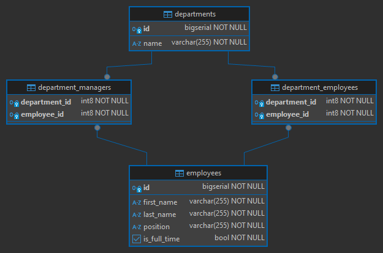

# [Joins with Spring Data R2DBC](https://neilwhite.ca/joins-with-spring-data-r2dbc/)

- [Repositorio del tutorial](https://github.com/neil-writes-code/reactive-spring-demo/tree/main)

---

`Spring Data R2DBC` nos permite escribir código sin bloqueo para interactuar con las bases de datos. A diferencia de los
otros proyectos de `Spring Data`, `Spring Data R2DBC` no es un ORM y tiene algunas limitaciones. **Una de esas
limitaciones es la asignación de combinaciones para entidades.** Esto presenta un desafío para aquellos familiarizados
con `Spring Data JPA`.

> **¿Cómo se escribe código que no bloquee, al mismo tiempo que se unen y mapean entidades complejas?**

## Spring Data R2DBC

Al igual que otros proyectos de `Spring Data`, el objetivo de `Spring Data R2DBC` es facilitar el trabajo con bases de
datos. Para lograrlo de forma reactiva, tuvieron que eliminar muchas funciones. `Spring Data R2DBC` no es un marco ORM
y `no admite joins`.

Para una entidad simple, sin relaciones, `R2DBC` funciona muy bien. Cree una clase de entidad y un `repository` de
soporte.

Cuando se trata de entidades con relaciones, este patrón ya no funciona. Para superar esto, necesitamos crear nuestra
propia implementación de `repository` utilizando `DatabaseClient`.

## Dependencias

````xml
<!--Spring Boo 3.3.3-->
<!--Java 21-->
<dependencies>
    <dependency>
        <groupId>org.springframework.boot</groupId>
        <artifactId>spring-boot-starter-data-r2dbc</artifactId>
    </dependency>
    <dependency>
        <groupId>org.springframework.boot</groupId>
        <artifactId>spring-boot-starter-validation</artifactId>
    </dependency>
    <dependency>
        <groupId>org.springframework.boot</groupId>
        <artifactId>spring-boot-starter-webflux</artifactId>
    </dependency>

    <dependency>
        <groupId>org.postgresql</groupId>
        <artifactId>postgresql</artifactId>
        <scope>runtime</scope>
    </dependency>
    <dependency>
        <groupId>org.postgresql</groupId>
        <artifactId>r2dbc-postgresql</artifactId>
        <scope>runtime</scope>
    </dependency>
    <dependency>
        <groupId>org.projectlombok</groupId>
        <artifactId>lombok</artifactId>
        <optional>true</optional>
    </dependency>
    <dependency>
        <groupId>org.springframework.boot</groupId>
        <artifactId>spring-boot-starter-test</artifactId>
        <scope>test</scope>
    </dependency>
    <dependency>
        <groupId>io.projectreactor</groupId>
        <artifactId>reactor-test</artifactId>
        <scope>test</scope>
    </dependency>
</dependencies>
````

## Las entidades

Utilizaremos dos entidades, un `Employee` básico y un `Department` que tiene dos relaciones diferentes con el
`Employee`.

Si traducimos estas entidades a tablas relacionadas en la base de datos, tendríamos el siguiente esquema.



Para nuestro caso de negocio, diremos lo siguiente:

- Un departamento solo tiene un gerente (manager).
- Un empleado puede ser gerente de un único departamento.
- Un departamento tiene muchos empleados.
- Un empleado solo pertenece a un departamento.

Basándonos en el esquema definido, vamos a crear las instrucciones `DDL` para crear las tablas. Estas instrucciones las
crearemos en el archivo `src/main/resources/schema.sql`.

````sql
CREATE TABLE IF NOT EXISTS employees(
    id BIGSERIAL PRIMARY KEY,
    first_name VARCHAR(255) NOT NULL,
    last_name VARCHAR(255) NOT NULL,
    position VARCHAR(255) NOT NULL,
    is_full_time BOOLEAN NOT NULL
);

CREATE TABLE IF NOT EXISTS departments(
    id BIGSERIAL PRIMARY KEY,
    name VARCHAR(255) NOT NULL UNIQUE
);

CREATE TABLE IF NOT EXISTS department_managers(
    department_id BIGINT,
    employee_id BIGINT,
    CONSTRAINT pk_dm PRIMARY KEY(department_id, employee_id),
    CONSTRAINT fk_departments_dm FOREIGN KEY(department_id) REFERENCES departments(id),
    CONSTRAINT fk_employees_dm FOREIGN KEY(employee_id) REFERENCES employees(id),
    CONSTRAINT uk_department_id_dm UNIQUE(department_id),
    CONSTRAINT uk_employee_id_dm UNIQUE(employee_id)
);

CREATE TABLE IF NOT EXISTS department_employees(
    department_id BIGINT,
    employee_id BIGINT,
    CONSTRAINT pk_de PRIMARY KEY(department_id, employee_id),
    CONSTRAINT fk_departments_de FOREIGN KEY(department_id) REFERENCES departments(id),
    CONSTRAINT fk_employees_de FOREIGN KEY(employee_id) REFERENCES employees(id),
    CONSTRAINT uk_employee_id_de UNIQUE(employee_id)
);
````

Ahora, en el mismo directorio crearemos el archivo `src/main/resources/data.sql` con las instrucciones `DML` para
poblar las tablas.

Es importante notar que las dos primeras líneas, son instrucciones que permiten truncar las tablas principales
`departments` y `employees`, dado que, cada vez que levantemos la aplicación, vamos a volver a poblar las tablas
con los mismos registros. Usar `CASCADE` eliminará todos los datos de las tablas relacionadas.

````sql
TRUNCATE TABLE departments RESTART IDENTITY CASCADE;
TRUNCATE TABLE employees RESTART IDENTITY CASCADE;

INSERT INTO employees(first_name, last_name, position, is_full_time)
VALUES('Carlos', 'Gómez', 'Gerente', true),
('Ana', 'Martínez', 'Desarrollador', true),
('Luis', 'Fernández', 'Diseñador', false),
('María', 'Rodríguez', 'Analista', true),
('José', 'Pérez', 'Soporte', true),
('Laura', 'Sánchez', 'Desarrollador', true),
('Jorge', 'López', 'Analista', false),
('Sofía', 'Díaz', 'Gerente', true),
('Manuel', 'Torres', 'Soporte', true),
('Lucía', 'Morales', 'Diseñador', true),
('Miguel', 'Hernández', 'Desarrollador', true),
('Elena', 'Ruiz', 'Analista', false),
('Pablo', 'Jiménez', 'Desarrollador', true),
('Carmen', 'Navarro', 'Soporte', true),
('Raúl', 'Domínguez', 'Gerente', true),
('Beatriz', 'Vargas', 'Desarrollador', true),
('Francisco', 'Muñoz', 'Soporte', true),
('Marta', 'Ortega', 'Diseñador', false),
('Andrés', 'Castillo', 'Analista', true),
('Isabel', 'Ramos', 'Desarrollador', true);

INSERT INTO departments(name)
VALUES('Recursos Humanos'),
('Tecnología'),
('Finanzas'),
('Marketing'),
('Ventas');

INSERT INTO department_managers(department_id, employee_id)
VALUES(1, 1),  -- Recursos Humanos - Carlos Gómez
(2, 8),  -- Tecnología - Sofía Díaz
(3, 15), -- Finanzas - Raúl Domínguez
(4, 4),  -- Marketing - María Rodríguez
(5, 20); -- Ventas - Isabel Ramos

INSERT INTO department_employees(department_id, employee_id)
VALUES(1, 5),  -- Recursos Humanos - José Pérez
(1, 7),  -- Recursos Humanos - Jorge López
(2, 2),  -- Tecnología - Ana Martínez
(2, 6),  -- Tecnología - Laura Sánchez
(2, 11), -- Tecnología - Miguel Hernández
(2, 13), -- Tecnología - Pablo Jiménez
(2, 20), -- Tecnología - Isabel Ramos
(3, 10), -- Finanzas - Lucía Morales
(4, 18), -- Marketing - Marta Ortega
(4, 12), -- Marketing - Elena Ruiz
(5, 3),  -- Ventas - Luis Fernández
(5, 9),  -- Ventas - Manuel Torres
(5, 14), -- Ventas - Carmen Navarro
(5, 16), -- Ventas - Beatriz Vargas
(5, 17), -- Ventas - Francisco Muñoz
(5, 19); -- Ventas - Andrés Castillo
````

## Configura propiedades de la aplicación

En el `application.yml` agregaremos las siguientes configuraciones. Notar que la base de datos que estamos usando
se llama `db_webflux_r2dbc`. Esta base de datos la crearemos en el siguiente apartado.

````yml
server:
  port: 8080
  error:
    include-message: always

spring:
  application:
    name: webflux-r2dbc-joins
  r2dbc:
    url: r2dbc:postgresql://localhost:5433/db_webflux_r2dbc
    username: magadiflo
    password: magadiflo

logging:
  level:
    dev.magadiflo.app: DEBUG
    io.r2dbc.postgresql.QUERY: DEBUG
    io.r2dbc.postgresql.PARAM: DEBUG
````

## Base de datos Postgres con docker compose

Vamos a crear nuestra base de datos usando `compose` de docker.

````yml
services:
  postgres:
    image: postgres:15.2-alpine
    container_name: c-postgres
    restart: unless-stopped
    environment:
      POSTGRES_DB: db_webflux_r2dbc
      POSTGRES_USER: magadiflo
      POSTGRES_PASSWORD: magadiflo
    ports:
      - '5433:5432'
    volumes:
      - postgres_data:/var/lib/postgresql/data

volumes:
  postgres_data:
    name: postgres_data
````

## Crear esquema de base de datos y poblar tablas

Cada vez que iniciemos la aplicación, se ejecutarán los scripts que estamos definiendo en este `@Bean` de configuración,
de esta manera nos aseguramos de que las tablas de la base de dato siempre estén pobladas al iniciar la aplicación.
Cabe resaltar que aunque el archivo `schema.sql` se ejecute cada vez que se inicie la aplicación, solo se crearán las
tablas una sola vez, dado que colocamos en las instrucciónes `DML` lo siguiente `CREATE TABLE IF NOT EXISTS...`.

````java

@Configuration
public class DatabaseConfig {
    @Bean
    public ConnectionFactoryInitializer initializer(ConnectionFactory connectionFactory) {
        ClassPathResource schemaResource = new ClassPathResource("schema.sql");
        ClassPathResource dataResource = new ClassPathResource("data.sql");
        ResourceDatabasePopulator resourceDatabasePopulator = new ResourceDatabasePopulator(schemaResource, dataResource);

        ConnectionFactoryInitializer initializer = new ConnectionFactoryInitializer();
        initializer.setConnectionFactory(connectionFactory);
        initializer.setDatabasePopulator(resourceDatabasePopulator);
        return initializer;
    }
}
````

## Entidades

A continuación se muestran las dos entidades con las que trabajaremos en este proyecto.

````java

@ToString
@AllArgsConstructor
@NoArgsConstructor
@Builder
@Setter
@Getter
@Table(name = "employees")
public class Employee {
    @Id
    private Long id;
    private String firstName;
    private String lastName;
    private String position;
    @Column("is_full_time")
    private boolean fullTime;

    public static Employee fromRow(Map<String, Object> row) {
        if (row.get("e_id") == null) return null;

        return Employee.builder()
                .id(Long.parseLong(row.get("e_id").toString()))
                .firstName((String) row.get("e_firstName"))
                .lastName((String) row.get("e_lastName"))
                .position((String) row.get("e_position"))
                .fullTime((Boolean) row.get("e_isFullTime"))
                .build();
    }

    public static Employee managerFromRow(Map<String, Object> row) {
        if (row.get("m_id") == null) return null;

        return Employee.builder()
                .id(Long.parseLong(row.get("m_id").toString()))
                .firstName((String) row.get("m_firstName"))
                .lastName((String) row.get("m_lastName"))
                .position((String) row.get("m_position"))
                .fullTime((Boolean) row.get("m_isFullTime"))
                .build();
    }
}
````

````java

@ToString
@AllArgsConstructor
@NoArgsConstructor
@Builder
@Setter
@Getter
@Table(name = "departments")
public class Department {
    @Id
    private Long id;
    private String name;

    private Employee manager;

    @Builder.Default
    private List<Employee> employees = new ArrayList<>();

    public Optional<Employee> getManager() {
        return Optional.ofNullable(this.manager);
    }

    public static Mono<Department> fromRows(List<Map<String, Object>> rows) {
        Map<String, Object> firstRow = rows.getFirst();

        Department department = Department.builder()
                .id(Long.parseLong(firstRow.get("d_id").toString()))
                .name(String.valueOf(firstRow.get("d_name")))
                .manager(Employee.managerFromRow(firstRow))
                .employees(rows.stream()
                        .map(Employee::fromRow)
                        .filter(Objects::nonNull)
                        .toList())
                .build();
        return Mono.just(department);
    }

}
````

`@Builder.Default`, esta anotación se usa junto con la anotación `@Builder` de `Lombok`. Cuando utilizas `@Builder` para
generar un patrón de construcción (builder pattern), las variables de instancia que no son explícitamente establecidas
en el proceso de construcción pueden quedar con valores null. Sin embargo, al usar `@Builder.Default`, le indicas a
Lombok que use el valor por defecto proporcionado si no se establece un valor durante la construcción.

Notarás que estas entidades tienen métodos estáticos para crear objetos a partir de una entrada. Estos son los
resultados sin procesar de una llamada con DatabaseClient. Dado que `Spring Data R2DBC` no asigna estos objetos, tenemos
que escribir la lógica nosotros mismos. `row.get` es nuestro mejor amigo aquí, ya que nos permite extraer cualquier
columna y convertirla al tipo que necesitamos.

## Repositorios

Antes dije que los repositorios estándar son adecuados para entidades sin relaciones. Lo que significa que todo lo que
tenemos que hacer para `Employee` es crear nuestra interfaz que extienda de `R2dbcRepository`. Además, estamos creando
consultas personalizadas usando las convenciones de nombre de método.

````java
public interface EmployeeRepository extends R2dbcRepository<Employee, Long> {
    Flux<Employee> findAllByPosition(String position);

    Flux<Employee> findAllByFullTime(boolean isFullTime);

    Flux<Employee> findAllByPositionAndFullTime(String position, boolean isFullTime);

    Mono<Employee> findByFirstName(String firstName);
}
````

Ahora, si revisamos la entidad `Department`, esta entidad está relacionada con `Employee` a través de los atributos
`manager` y `employees`, por lo que crear una interfaz y extenderla de `R2dbcRepository` no es lo adecuado para traer
los datos relacionados.

Lo que haremos en este caso, será crear una interfaz y luego crearemos su propia implementación. Para mantener el mismo
patrón para el `Department`, necesitamos una interfaz y una clase de implementación, `DepartmentRepository` y
`DepartmentRepositoryImpl`.

````java
public interface DepartmentRepository {
    Flux<Department> findAll();

    Mono<Department> findById(Long departmentId);

    Mono<Department> findByName(String name);

    Mono<Department> save(Department department);

    Mono<Void> delete(Department department);
}
````

Damos a cada columna un alias para utilizar al extraer datos para crear nuestros objetos, como se ve en la siguiente
clase de entidad. `No es necesario utilizar alias`, **pero puede resultar útil si el nombre de una columna no coincide
con el nombre del campo.**

````java

@Slf4j
@RequiredArgsConstructor
@Repository
public class DepartmentRepositoryImpl implements DepartmentRepository {

    private final EmployeeRepository employeeRepository;
    private final DatabaseClient client;
    private static final String SELECT_QUERY = """
            SELECT d.id AS d_id,
                    d.name AS d_name,
                    m.id AS m_id,
                    m.first_name AS m_firstName,
                    m.last_name AS m_lastName,
                    m.position AS m_position,
                    m.is_full_time AS m_isFullTime,
                    e.id AS e_id,
                    e.first_name AS e_firstName,
                    e.last_name AS e_lastName,
                    e.position AS e_position,
                    e.is_full_time AS e_isFullTime
            FROM departments AS d
                LEFT JOIN department_managers AS dm ON(d.id = dm.department_id)
                LEFT JOIN employees AS m ON(dm.employee_id = m.id)
                LEFT JOIN department_employees AS de ON(d.id = de.department_id)
                LEFT JOIN employees AS e ON(de.employee_id = e.id)
            """;

    @Override
    public Flux<Department> findAll() {
        return this.client.sql(SELECT_QUERY)
                .fetch()
                .all()
                .bufferUntilChanged(result -> result.get("d_id"))
                .flatMap(Department::fromRows);
    }

    @Override
    public Mono<Department> findById(Long departmentId) {
        return this.client.sql("%s WHERE d.id = :departmentId".formatted(SELECT_QUERY))
                .bind("departmentId", departmentId)
                .fetch()
                .all()
                .bufferUntilChanged(result -> result.get("d_id"))
                .flatMap(Department::fromRows)
                .singleOrEmpty();
    }

    @Override
    public Mono<Department> findByName(String name) {
        return this.client.sql("%s WHERE d.name = :name".formatted(SELECT_QUERY))
                .bind("name", name)
                .fetch()
                .all()
                .bufferUntilChanged(result -> result.get("d_id"))
                .flatMap(Department::fromRows)
                .singleOrEmpty();
    }

    @Override
    public Mono<Department> save(Department department) {
        return this.saveDepartment(department)
                .flatMap(this::saveManager)
                .flatMap(this::saveEmployees)
                .flatMap(this::deleteDepartmentManager)
                .flatMap(this::saveDepartmentManager)
                .flatMap(this::deleteDepartmentEmployees)
                .flatMap(this::saveDepartmentEmployees);
    }

    @Override
    public Mono<Void> delete(Department department) {
        return this.deleteDepartmentManager(department)
                .flatMap(this::deleteDepartmentEmployees)
                .flatMap(this::deleteDepartment)
                .then();
    }

    private Mono<Department> saveDepartment(Department department) {
        if (department.getId() == null) {
            return this.client.sql("""
                            INSERT INTO departments(name)
                            VALUES(:name)
                            """)
                    .bind("name", department.getName())
                    .filter((statement, next) -> statement.returnGeneratedValues("id").execute())
                    .fetch()
                    .first()
                    .doOnNext(result -> department.setId(Long.parseLong(result.get("id").toString())))
                    .thenReturn(department);
        }
        return this.client.sql("""
                        UPDATE departments
                        SET name = :name
                        WHERE id = :departmentId
                        """)
                .bind("name", department.getName())
                .bind("departmentId", department.getId())
                .fetch()
                .first()
                .thenReturn(department);
    }

    private Mono<Department> saveManager(Department department) {
        return Mono.justOrEmpty(department.getManager())
                .flatMap(this.employeeRepository::save)
                .doOnNext(department::setManager)
                .thenReturn(department);
    }

    private Mono<Department> saveEmployees(Department department) {
        return Flux.fromIterable(department.getEmployees())
                .flatMap(this.employeeRepository::save)
                .collectList()
                .doOnNext(department::setEmployees)
                .thenReturn(department);
    }

    private Mono<Department> deleteDepartmentManager(Department department) {
        final String QUERY = """
                DELETE FROM department_managers WHERE department_id = :departmentId OR employee_id = :managerId
                """;
        return Mono.just(department)
                .flatMap(dep -> client.sql(QUERY)
                        .bind("departmentId", dep.getId())
                        .bind("managerId", dep.getManager().orElseGet(() -> Employee.builder().id(0L).build()).getId())
                        .fetch()
                        .rowsUpdated())
                .thenReturn(department);
    }

    private Mono<Department> saveDepartmentManager(Department department) {
        final String QUERY = """
                INSERT INTO department_managers(department_id, employee_id)
                VALUES(:departmentId, :employeeId)
                """;

        return Mono.justOrEmpty(department.getManager())
                .flatMap(manager -> client.sql(QUERY)
                        .bind("departmentId", department.getId())
                        .bind("employeeId", manager.getId())
                        .fetch()
                        .rowsUpdated())
                .thenReturn(department);
    }

    private Mono<Department> deleteDepartmentEmployees(Department department) {
        final String QUERY = """
                DELETE FROM department_employees WHERE department_id = :departmentId OR employee_id IN (:employeeIds)
                """;

        List<Long> employeeIds = department.getEmployees().stream().map(Employee::getId).toList();

        return Mono.just(department)
                .flatMap(dep -> client.sql(QUERY)
                        .bind("departmentId", department.getId())
                        .bind("employeeIds", employeeIds.isEmpty() ? List.of(0) : employeeIds)
                        .fetch()
                        .rowsUpdated())
                .thenReturn(department);
    }

    private Mono<Department> saveDepartmentEmployees(Department department) {
        final String QUERY = """
                INSERT INTO department_employees(department_id, employee_id)
                VALUES(:departmentId, :employeeId)
                """;

        return Flux.fromIterable(department.getEmployees())
                .flatMap(employee -> client.sql(QUERY)
                        .bind("departmentId", department.getId())
                        .bind("employeeId", employee.getId())
                        .fetch()
                        .rowsUpdated())
                .collectList()
                .thenReturn(department);
    }

    private Mono<Void> deleteDepartment(Department department) {
        return this.client.sql("DELETE FROM departments WHERE id = :departmentId")
                .bind("departmentId", department.getId())
                .fetch()
                .first()
                .then();
    }
}
````

Analicemos en detalle lo que hace el método `findAll()`:

````java

@Override
public Flux<Department> findAll() {
    return this.client.sql(SELECT_QUERY)
            .fetch()
            .all()
            .bufferUntilChanged(result -> result.get("d_id"))
            .flatMap(Department::fromRows);
}
````

Primero tenemos `client.sql(SELECT_QUERY).fetch().all()`, que recupera todos los datos que solicitamos en nuestra
consulta. Dado que estamos uniendo tablas, tendremos varias filas para cada `Department`.
`.bufferUntilChanged(result -> result.get("d_id"))` recopila todas las mismas filas juntas en una
`List<Map<String, Object>`, antes de pasarla finalmente a nuestra última línea que extrae los datos y devuelve
nuestros objetos `Department`.

Utilizar `.bufferUntilChanged(result -> result.get("d_id"))` es una forma eficaz de agrupar filas por departamento
`(d_id)`. De esta manera, obtienes todos los registros relacionados con el mismo departamento en una sola emisión.

Para resumir:

- `.client.sql(SELECT_QUERY).fetch().all()`, obtenga todos los datos que solicitamos.
- `.bufferUntilChanged(result -> result.get("d_id"))`, agrupe las filas en una lista según `department.id`.
- `.flatMap(Department::fromRows)`, convierta cada conjunto de resultados en un `Department`.

## Persistiendo entidades

Recuperar una entidad es sencillo: se solicitan algunos datos y se crea un objeto a partir de ellos. Pero, ¿qué sucede
si queremos conservar los datos? Debemos conservar el departamento, el gerente, el empleado y una lista de empleados.
No compartiré todo el código para esto, ya que es bastante largo, pero explicaré la idea de cómo funciona.

La forma más sencilla de comprender la conservación de estas entidades es mediante una `cadena de pasos`.
Para nuestras entidades de ejemplo, se vería así:

- Guardar o actualizar el `Department`
- Guardar o actualizar el gerente (manager) `Employee`
- Guardar o actualizar cada empleado
- Actualizar la relación entre el `Department` y `Manager`
- Actualizar la relación entre el `Department` y `Employee`

El método público se ve exactamente como el siguiente código

````java

@Override
public Mono<Department> save(Department department) {
    return this.saveDepartment(department)
            .flatMap(this::saveManager)
            .flatMap(this::saveEmployees)
            .flatMap(this::deleteDepartmentManager)
            .flatMap(this::saveDepartmentManager)
            .flatMap(this::deleteDepartmentEmployees)
            .flatMap(this::saveDepartmentEmployees);
}
````

Pasamos el `Department` inicial por cada paso, modificando el estado a medida que avanzamos.

A continuación se muestra el primer paso de este proceso: `saveDepartment`.

````java
private Mono<Department> saveDepartment(Department department) {
    if (department.getId() == null) {
        return this.client.sql("""
                        INSERT INTO departments(name)
                        VALUES(:name)
                        """)
                .bind("name", department.getName())
                .filter((statement, next) -> statement.returnGeneratedValues("id").execute())
                .fetch()
                .first()
                .doOnNext(result -> department.setId(Long.parseLong(result.get("id").toString())))
                .thenReturn(department);
    }
    return this.client.sql("""
                    UPDATE departments
                    SET name = :name
                    WHERE id = :departmentId
                    """)
            .bind("name", department.getName())
            .bind("departmentId", department.getId())
            .fetch()
            .first()
            .thenReturn(department);
}
````

Vemos que hay dos ramas, una para persistir una nueva entidad y otra para actualizarla. En la primera, usamos nuestro
cliente para insertar un nuevo `Department`, devolviendo un `id`. Luego, establecemos el `id` de nuestro objeto
`Department` antes de devolverlo para el siguiente paso. Cada paso posterior hará lo mismo, persistirá una entidad y la
establecerá nuevamente como nuestra entidad principal.

Una vez que se haya persistido el `Department`, podemos pasar a las otras entidades anidadas. Cada entidad anidada
requiere tres pasos, que verá a continuación para el administrador del departamento.

Primero persistimos el administrador. El uso de `EmployeeRepository` facilita esto, ya que no tenemos que decidir entre
una inserción o una actualización como lo hacemos con el `Department`. Una vez que se persiste, establecemos el objeto
de administrador del Departamento en el Empleado nuevo/actualizado.

````java
private Mono<Department> saveManager(Department department) {
    return Mono.justOrEmpty(department.getManager())
            .flatMap(this.employeeRepository::save)
            .doOnNext(department::setManager)
            .thenReturn(department);
}
````

Una vez que se ha conservado la entidad, queremos conservar la relación entre el departamento y el empleado. Primero
debemos eliminar cualquier relación existente.

````java
private Mono<Department> deleteDepartmentManager(Department department) {
    final String QUERY = """
            DELETE FROM department_managers WHERE department_id = :departmentId OR employee_id = :managerId
            """;
    return Mono.just(department)
            .flatMap(dep -> client.sql(QUERY)
                    .bind("departmentId", dep.getId())
                    .bind("managerId", dep.getManager().orElseGet(() -> Employee.builder().id(0L).build()).getId())
                    .fetch()
                    .rowsUpdated())
            .thenReturn(department);
}
````

Luego, debemos mantener la nueva relación. Una característica útil de `Mono` es que devuelve de `0 a 1` objetos, por lo
que si el `manager` está vacío, no se llama a `.flatMap` y pasamos a devolver el `Department` al final del método.

````java
private Mono<Department> saveDepartmentManager(Department department) {
    final String QUERY = """
            INSERT INTO department_managers(department_id, employee_id)
            VALUES(:departmentId, :employeeId)
            """;

    return Mono.justOrEmpty(department.getManager())
            .flatMap(manager -> client.sql(QUERY)
                    .bind("departmentId", department.getId())
                    .bind("employeeId", manager.getId())
                    .fetch()
                    .rowsUpdated())
            .thenReturn(department);
}
````

Para resumir, persistimos nuestro `Department`, persistimos cualquier entidad anidada `(Empleado)` y luego creamos una
relación entre los dos.

## DTOs

````java
public record CreateEmployeeRequest(@NotBlank
                                    String firstName,

                                    @NotBlank
                                    String lastName,

                                    @NotBlank
                                    String position,

                                    @NotNull
                                    Boolean isFullTime) {
}
````

````java
public record CreateDepartmentRequest(@NotBlank
                                      String name) {
}
````

## Excepciones

````java
public class EmployeeNotFoundException extends RuntimeException {
    public EmployeeNotFoundException(Long employeeId) {
        super("El empleado con id %d no fue encontrado".formatted(employeeId));
    }
}
````

````java
public class DepartmentNotFoundException extends RuntimeException {
    public DepartmentNotFoundException(Long departmentId) {
        super("El departamento con id %d no fue encontrado".formatted(departmentId));
    }
}
````

````java
public class DepartmentAlreadyExistsException extends RuntimeException {
    public DepartmentAlreadyExistsException(String name) {
        super("El departamento con nombre %s ya existe".formatted(name));
    }
}
````

## Manejo de excepciones

````java
public record ErrorResponse(Map<String, Object> errors) {
}
````

````java

@Slf4j
@RestControllerAdvice
public class GlobalExceptionHandler {

    @ExceptionHandler({
            EmployeeNotFoundException.class,
            DepartmentNotFoundException.class
    })
    public Mono<ResponseEntity<ErrorResponse>> handleNotFoundException(Exception exception) {
        log.debug("handleNotFoundException:: {}", exception.getMessage());
        ErrorResponse response = new ErrorResponse(Map.of("message", exception.getMessage()));
        return Mono.just(ResponseEntity.status(HttpStatus.NOT_FOUND).body(response));
    }

    @ExceptionHandler(DepartmentAlreadyExistsException.class)
    public Mono<ResponseEntity<ErrorResponse>> handleAlreadyExistsException(Exception exception) {
        log.debug("handleAlreadyExistsException:: {}", exception.getMessage());
        ErrorResponse response = new ErrorResponse(Map.of("message", exception.getMessage()));
        return Mono.just(ResponseEntity.status(HttpStatus.BAD_REQUEST).body(response));
    }

    @ExceptionHandler(WebExchangeBindException.class)
    public ResponseEntity<ErrorResponse> handleException(WebExchangeBindException exception) {
        log.debug("webExchangeBindException:: {}", exception.getMessage());
        List<String> errors = exception.getBindingResult()
                .getAllErrors()
                .stream()
                .map(DefaultMessageSourceResolvable::getDefaultMessage)
                .toList();
        ErrorResponse response = new ErrorResponse(Map.of("errors", errors));
        return ResponseEntity.badRequest().body(response);
    }

    @ExceptionHandler(Exception.class)
    public ResponseEntity<ErrorResponse> handleException(Exception exception) {
        log.debug("handleException:: {}", exception.getMessage());
        exception.printStackTrace();
        ErrorResponse response = new ErrorResponse(Map.of("error", exception.getMessage()));
        return ResponseEntity.badRequest().body(response);
    }

}
````

## Servicios

````java
public interface EmployeeService {
    Flux<Employee> getAllEmployees(String position, Boolean isFullTime);

    Mono<Employee> showEmployee(Long employeeId);

    Mono<Employee> createEmployee(CreateEmployeeRequest employeeRequest);

    Mono<Employee> updateEmployee(Long employeeId, Employee employee);

    Mono<Void> deleteEmployee(Long employeeId);
}

````

````java
public interface DepartmentService {
    Flux<Department> getAllDepartments();

    Mono<Department> showDepartment(Long departmentId);

    Flux<Employee> getEmployeesFromDepartment(Long departmentId, Boolean isFullTime);

    Mono<Department> createDepartment(CreateDepartmentRequest departmentRequest);

    Mono<Department> updateDepartment(Long departmentId, Department department);

    Mono<Void> deleteDepartment(Long departmentId);
}
````

````java

@Slf4j
@RequiredArgsConstructor
@Service
@Transactional(readOnly = true)
public class EmployeeServiceImpl implements EmployeeService {

    private final EmployeeRepository employeeRepository;


    @Override
    public Flux<Employee> getAllEmployees(String position, Boolean isFullTime) {
        if (position == null && isFullTime == null) {
            return this.employeeRepository.findAll();
        }

        if (position != null & isFullTime != null) {
            return this.employeeRepository.findAllByPositionAndFullTime(position, isFullTime);
        }

        if (position != null) {
            return this.employeeRepository.findAllByPosition(position);
        }

        return this.employeeRepository.findAllByFullTime(isFullTime);
    }

    @Override
    public Mono<Employee> showEmployee(Long employeeId) {
        return this.employeeRepository.findById(employeeId)
                .switchIfEmpty(Mono.error(new EmployeeNotFoundException(employeeId)));
    }

    @Override
    @Transactional
    public Mono<Employee> createEmployee(CreateEmployeeRequest employeeRequest) {
        Employee employee = Employee.builder()
                .firstName(employeeRequest.firstName())
                .lastName(employeeRequest.lastName())
                .position(employeeRequest.position())
                .fullTime(employeeRequest.isFullTime())
                .build();
        return this.employeeRepository.save(employee);
    }

    @Override
    @Transactional
    public Mono<Employee> updateEmployee(Long employeeId, Employee employee) {
        return this.employeeRepository.findById(employeeId)
                .switchIfEmpty(Mono.error(new EmployeeNotFoundException(employeeId)))
                .map(employeeDB -> {
                    employeeDB.setFirstName(employee.getFirstName());
                    employeeDB.setLastName(employee.getLastName());
                    employeeDB.setPosition(employee.getPosition());
                    employeeDB.setFullTime(employee.isFullTime());
                    return employeeDB;
                })
                .flatMap(this.employeeRepository::save);
    }

    @Override
    @Transactional
    public Mono<Void> deleteEmployee(Long employeeId) {
        return this.employeeRepository.findById(employeeId)
                .switchIfEmpty(Mono.error(new EmployeeNotFoundException(employeeId)))
                .flatMap(this.employeeRepository::delete)
                .then();
    }
}
````

````java

@Slf4j
@RequiredArgsConstructor
@Service
@Transactional(readOnly = true)
public class DepartmentServiceImpl implements DepartmentService {

    private final DepartmentRepository departmentRepository;

    @Override
    public Flux<Department> getAllDepartments() {
        return this.departmentRepository.findAll();
    }

    @Override
    public Mono<Department> showDepartment(Long departmentId) {
        return this.departmentRepository.findById(departmentId)
                .switchIfEmpty(Mono.error(new DepartmentNotFoundException(departmentId)));
    }

    @Override
    public Flux<Employee> getEmployeesFromDepartment(Long departmentId, Boolean isFullTime) {
        if (isFullTime != null) {
            return this.departmentRepository.findById(departmentId)
                    .switchIfEmpty(Mono.error(new DepartmentNotFoundException(departmentId)))
                    .flatMapMany(departmentDB -> {
                        Stream<Employee> employeeStream = departmentDB.getEmployees().stream()
                                .filter(employee -> employee.isFullTime() == isFullTime);
                        return Flux.fromStream(employeeStream);
                    });
        }

        return this.departmentRepository.findById(departmentId)
                .switchIfEmpty(Mono.error(new DepartmentNotFoundException(departmentId)))
                .flatMapMany(department -> Flux.fromIterable(department.getEmployees()));
    }

    @Override
    @Transactional
    public Mono<Department> createDepartment(CreateDepartmentRequest departmentRequest) {
        return this.departmentRepository.findByName(departmentRequest.name())
                .flatMap(departmentDB -> Mono.error(new DepartmentAlreadyExistsException(departmentRequest.name())))
                .defaultIfEmpty(Department.builder().name(departmentRequest.name()).build())
                .cast(Department.class)
                .flatMap(this.departmentRepository::save);
    }

    @Override
    @Transactional
    public Mono<Department> updateDepartment(Long departmentId, Department department) {
        return this.departmentRepository.findById(departmentId)
                .switchIfEmpty(Mono.error(new DepartmentNotFoundException(departmentId)))
                .map(departmentDB -> {
                    departmentDB.setName(department.getName());
                    if (department.getManager().isPresent()) {
                        departmentDB.setManager(department.getManager().get());
                    }
                    departmentDB.setEmployees(department.getEmployees());
                    return departmentDB;
                })
                .flatMap(this.departmentRepository::save);
    }

    @Override
    @Transactional
    public Mono<Void> deleteDepartment(Long departmentId) {
        return this.departmentRepository.findById(departmentId)
                .switchIfEmpty(Mono.error(new DepartmentNotFoundException(departmentId)))
                .flatMap(this.departmentRepository::delete);
    }
}
````

## Controladores

````java

@Slf4j
@RequiredArgsConstructor
@RestController
@RequestMapping(path = "/api/v1/employees")
public class EmployeeController {

    private final EmployeeService employeeService;

    @GetMapping
    public Mono<ResponseEntity<Flux<Employee>>> findAllEmployees(@RequestParam(required = false) String position,
                                                                 @RequestParam(name = "fullTime", required = false) Boolean isFullTime) {
        return Mono.just(ResponseEntity.ok(this.employeeService.getAllEmployees(position, isFullTime)));
    }

    @GetMapping(path = "/{employeeId}")
    public Mono<ResponseEntity<Employee>> findEmployee(@PathVariable Long employeeId) {
        return this.employeeService.showEmployee(employeeId)
                .map(ResponseEntity::ok);
    }

    @PostMapping
    public Mono<ResponseEntity<Employee>> saveEmployee(@Valid @RequestBody CreateEmployeeRequest employeeRequest) {
        return this.employeeService.createEmployee(employeeRequest)
                .map(employeeDB -> new ResponseEntity<>(employeeDB, HttpStatus.CREATED));
    }

    @PutMapping(path = "/{employeeId}")
    public Mono<ResponseEntity<Employee>> updateEmployee(@PathVariable Long employeeId, @RequestBody Employee employee) {
        return this.employeeService.updateEmployee(employeeId, employee)
                .map(ResponseEntity::ok);
    }

    @DeleteMapping(path = "/{employeeId}")
    public Mono<ResponseEntity<Void>> deleteEmployee(@PathVariable Long employeeId) {
        return this.employeeService.deleteEmployee(employeeId)
                .thenReturn(ResponseEntity.noContent().build());
    }
}
````

````java

@Slf4j
@RequiredArgsConstructor
@RestController
@RequestMapping(path = "/api/v1/departments")
public class DepartmentController {

    private final DepartmentService departmentService;

    @GetMapping
    public Mono<ResponseEntity<Flux<Department>>> findAllDepartments() {
        return Mono.just(ResponseEntity.ok(this.departmentService.getAllDepartments()));
    }

    @GetMapping(path = "/{departmentId}")
    public Mono<ResponseEntity<Department>> findDepartment(@PathVariable Long departmentId) {
        return this.departmentService.showDepartment(departmentId)
                .map(ResponseEntity::ok);
    }

    @GetMapping(path = "/{departmentId}/employees")
    public Mono<ResponseEntity<Flux<Employee>>> getEmployeesFromDepartment(@PathVariable Long departmentId,
                                                                           @RequestParam(name = "fullTime", required = false) Boolean isFullTime) {
        return Mono.just(ResponseEntity.ok(this.departmentService.getEmployeesFromDepartment(departmentId, isFullTime)));
    }

    @PostMapping
    public Mono<ResponseEntity<Department>> saveDepartment(@Valid @RequestBody CreateDepartmentRequest request) {
        return this.departmentService.createDepartment(request)
                .map(departmentDB -> new ResponseEntity<>(departmentDB, HttpStatus.CREATED));
    }

    @PutMapping(path = "/{departmentId}")
    public Mono<ResponseEntity<Department>> updateDepartment(@PathVariable Long departmentId, @RequestBody Department department) {
        return this.departmentService.updateDepartment(departmentId, department)
                .map(ResponseEntity::ok);
    }

    @DeleteMapping(path = "/{departmentId}")
    public Mono<ResponseEntity<Void>> deleteDepartment(@PathVariable Long departmentId) {
        return this.departmentService.deleteDepartment(departmentId)
                .thenReturn(ResponseEntity.noContent().build());
    }

}
````

## Ejecutando aplicación y comprobando funcionamiento de endpoints

### Employee

Como parte de la comprobación, solo se ejecutará el método para listar todos los empleados y registrar un empleado, de
esta manera tendremos una idea del funcionamiento del endpoint.

````bash
$ curl -v http://localhost:8080/api/v1/employees | jq
>
< HTTP/1.1 200 OK
< transfer-encoding: chunked
< Content-Type: application/json
<
[
  {
    "id": 1,
    "firstName": "Carlos",
    "lastName": "Gómez",
    "position": "Gerente",
    "fullTime": true
  },
  {...},
  {
    "id": 20,
    "firstName": "Isabel",
    "lastName": "Ramos",
    "position": "Desarrollador",
    "fullTime": true
  }
]
````

````bash
$ curl -v -X POST -H "Content-Type: application/json" -d "{\"firstName\": \"Maria\", \"lastName\": \"Diaz\", \"position\": \"Desarrollador\", \"isFullTime\": false}" http://localhost:8080/api/v1/employees | jq
>
< HTTP/1.1 201 Created
<
{
  "id": 21,
  "firstName": "Maria",
  "lastName": "Diaz",
  "position": "Desarrollador",
  "fullTime": false
}
````

### Department

De la misma manera que se hizo con los employees, aquí también realizaremos unas cuantas peticiones a algunos endpoints
para tener una idea de su funcionamiento.

````bash
$ curl -v http://localhost:8080/api/v1/departments/4 | jq
>
< HTTP/1.1 200 OK
<
{
  "id": 4,
  "name": "Marketing",
  "manager": {
    "id": 4,
    "firstName": "María",
    "lastName": "Rodríguez",
    "position": "Analista",
    "fullTime": true
  },
  "employees": [
    {
      "id": 18,
      "firstName": "Marta",
      "lastName": "Ortega",
      "position": "Diseñador",
      "fullTime": false
    },
    {
      "id": 12,
      "firstName": "Elena",
      "lastName": "Ruiz",
      "position": "Analista",
      "fullTime": false
    }
  ]
}
````

````bash
$ curl -v -X POST -H "Content-Type: application/json" -d "{\"name\": \"Legal\"}" http://localhost:8080/api/v1/departments | jq
>
< HTTP/1.1 201 Created
<
{
  "id": 6,
  "name": "Legal",
  "manager": null,
  "employees": []
}
````

````bash
$ curl -v -X PUT -H "Content-Type: application/json" -d "{\"name\": \"Legalizado\", \"manager\": {\"firstName\": \"Martin\", \"lastName\": \"Diaz\", \"position\": \"Desarrollador\", \"fullTime\": true}}" http://localhost:8080/api/v1/departments/6 | jq
>
< HTTP/1.1 200 OK
<
{
  "id": 6,
  "name": "Legalizado",
  "manager": {
    "id": 22,
    "firstName": "Martin",
    "lastName": "Diaz",
    "position": "Desarrollador",
    "fullTime": true
  },
  "employees": []
} 
````
