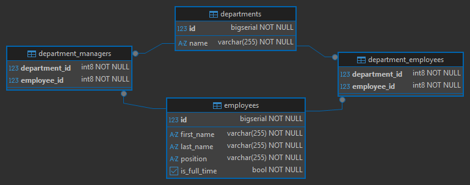

# 🔗 Joins con Spring Data R2DBC | Unit & Integration Test

- [Repositorio de referencia: reactive-spring-demo](https://github.com/neil-writes-code/reactive-spring-demo)

---

## 📌 Concepto clave

`Spring Data R2DBC` permite interactuar con bases de datos de manera reactiva y sin bloqueo.
A diferencia de `Spring Data JPA`, no es un ORM y por lo tanto no soporta joins automáticos ni relaciones complejas
entre entidades.

👉 Esto significa que si vienes del mundo JPA/Hibernate, **no encontrarás anotaciones como**
`@OneToMany`, `@ManyToOne` o `@JoinColumn` funcionando de forma automática.

### ⚠️ Limitación principal

- No hay soporte nativo para joins entre entidades.
- Cada entidad se mapea de forma independiente.
- Si necesitas combinar datos de varias tablas, debes hacerlo manualmente.

### 🛠️ Estrategia para superar la limitación

Para manejar relaciones y joins en R2DBC, se recomienda:

1. Usar `DatabaseClient` o `R2dbcEntityTemplate`: Permiten ejecutar queries SQL personalizados y mapear los resultados
   a objetos.
2. Crear `DTOs` específicos para resultados combinados: En lugar de intentar mapear directamente a entidades
   relacionadas, defines clases como `DepartmentResponse` que representen el resultado del join.
3. Separar responsabilidades:
    - `Entidades` → representan tablas individuales.
    - `DTOs` → representan vistas o combinaciones de datos.
    - `Repositorios personalizados` → encapsulan queries complejas.

### ✅ Buenas prácticas en proyectos reales

- Mantén las entidades simples (solo columnas directas).
- Usa `repositorios personalizados` para queries con joins.
- Documenta claramente qué queries son reactivas y cómo se manejan los resultados.
- Evita replicar el modelo relacional completo en el código; piensa en agregados y casos de uso.

## 🐳 Docker Compose: Bases de datos para desarrollo y test

Definir contenedores de PostgreSQL para:

- `Desarrollo` → base de datos principal (`db_webflux_r2dbc`).
- `Test` → base de datos aislada (`db_webflux_r2dbc_test`).

Esto asegura que las pruebas no afecten los datos de desarrollo.

### ⚙️ Configuración

````yml
services:
  s-postgres-webflux:
    image: postgres:17-alpine
    container_name: c-postgres-webflux
    restart: unless-stopped
    environment:
      POSTGRES_DB: db_webflux_r2dbc
      POSTGRES_USER: magadiflo
      POSTGRES_PASSWORD: magadiflo
    ports:
      - '5435:5432'
    volumes:
      - postgres-webflux-data:/var/lib/postgresql/data
    networks:
      - webflux-net

  s-postgres-webflux-test:
    image: postgres:17-alpine
    container_name: c-postgres-webflux-test
    restart: unless-stopped
    environment:
      POSTGRES_DB: db_webflux_r2dbc_test
      POSTGRES_USER: magadiflo
      POSTGRES_PASSWORD: magadiflo
    ports:
      - '5436:5432'
    networks:
      - webflux-net

volumes:
  postgres-webflux-data:
    name: postgres-webflux-data

networks:
  webflux-net:
    name: webflux-net
````

### 📝 Notas importantes

- 📂 `Volumen persistente`: solo se define para la BD de desarrollo, ya que en test normalmente se recrea la BD en cada
  ejecución.
- 🔒 `Usuarios y contraseñas`: mantenerlos en variables de entorno externas (`.env`) para mayor seguridad.
- 🧪 `Base de datos de test`: se recomienda inicializar con datos controlados (scripts o Testcontainers) para pruebas
  reproducibles.
- 🌐 `Red compartida (webflux-net)`: permite que los servicios se comuniquen entre sí.

## ⚙️ Creando proyecto con Spring Data R2DBC

### 📦 Dependencias principales

````xml
<!--Spring Boot 3.5.9-->
<!--Java 21-->
<dependencies>
    <dependency>
        <groupId>org.springframework.boot</groupId>
        <artifactId>spring-boot-starter-data-r2dbc</artifactId>
    </dependency>
    <dependency>
        <groupId>org.springframework.boot</groupId>
        <artifactId>spring-boot-starter-validation</artifactId>
    </dependency>
    <dependency>
        <groupId>org.springframework.boot</groupId>
        <artifactId>spring-boot-starter-webflux</artifactId>
    </dependency>

    <dependency>
        <groupId>org.postgresql</groupId>
        <artifactId>postgresql</artifactId>
        <scope>runtime</scope>
    </dependency>
    <dependency>
        <groupId>org.postgresql</groupId>
        <artifactId>r2dbc-postgresql</artifactId>
        <scope>runtime</scope>
    </dependency>
    <dependency>
        <groupId>org.projectlombok</groupId>
        <artifactId>lombok</artifactId>
        <optional>true</optional>
    </dependency>
    <dependency>
        <groupId>org.springframework.boot</groupId>
        <artifactId>spring-boot-starter-test</artifactId>
        <scope>test</scope>
    </dependency>
    <dependency>
        <groupId>io.projectreactor</groupId>
        <artifactId>reactor-test</artifactId>
        <scope>test</scope>
    </dependency>
</dependencies>
````

## ⚙️ Configuración de propiedades (`application.yml`)

El archivo `application.yml` define las propiedades principales de la aplicación, incluyendo el puerto del servidor, la
conexión a la base de datos y el nivel de logging.

````yml
server:
  port: 8080
  error:
    include-message: always

spring:
  application:
    name: webflux-crud-test
  r2dbc:
    url: r2dbc:postgresql://localhost:5435/db_webflux_r2dbc
    username: magadiflo
    password: magadiflo

logging:
  level:
    dev.magadiflo.app: debug
    io.r2dbc.postgresql.QUERY: debug
    io.r2dbc.postgresql.PARAM: debug
````

### 📌 Observaciones

- `spring.r2dbc.url`: URL de conexión reactiva a PostgreSQL.
    - `r2dbc:postgresql://localhost:5435/db_webflux_r2dbc`
    - `5435` corresponde al puerto mapeado en Docker Compose.
    - `db_webflux_r2dbc` es la base de datos definida en el contenedor de desarrollo.
- `logging.level`: Configuración de niveles de log.
    - `dev.magadiflo.app: debug` → activa logs detallados para el paquete de la aplicación.
    - `io.r2dbc.postgresql.QUERY: debug` → muestra las queries ejecutadas.
    - `io.r2dbc.postgresql.PARAM: debug` → muestra los parámetros enviados en las queries.

✅ Esto es muy útil para depuración en desarrollo, pero en producción se recomienda reducir el nivel a `info` o `warn`.

## 🗄️ Creación de tablas (DDL)

Las reglas de negocio que definiste son correctas y se reflejan bien en el esquema SQL:

- Un `department` tiene un único `manager`.
- Un `employee` puede ser manager de un solo `department`.
- Un `department` tiene muchos `employees`.
- Un `employee` pertenece a un único `department`.

Esto se traduce en las siguientes tablas definidas en el archivo `src/main/resources/sql/schema.sql`.

````bash
CREATE TABLE IF NOT EXISTS employees(
    id BIGSERIAL PRIMARY KEY,
    first_name VARCHAR(255) NOT NULL,
    last_name VARCHAR(255) NOT NULL,
    position VARCHAR(255) NOT NULL,
    is_full_time BOOLEAN NOT NULL
);

CREATE TABLE IF NOT EXISTS departments(
    id BIGSERIAL PRIMARY KEY,
    name VARCHAR(255) NOT NULL UNIQUE
);

CREATE TABLE IF NOT EXISTS department_managers(
    department_id BIGINT,
    employee_id BIGINT,
    CONSTRAINT pk_dm PRIMARY KEY(department_id, employee_id),
    CONSTRAINT fk_departments_dm FOREIGN KEY(department_id) REFERENCES departments(id),
    CONSTRAINT fk_employees_dm FOREIGN KEY(employee_id) REFERENCES employees(id),
    CONSTRAINT uk_department_id_dm UNIQUE(department_id),
    CONSTRAINT uk_employee_id_dm UNIQUE(employee_id)
);

CREATE TABLE IF NOT EXISTS department_employees(
    department_id BIGINT,
    employee_id BIGINT,
    CONSTRAINT pk_de PRIMARY KEY(department_id, employee_id),
    CONSTRAINT fk_departments_de FOREIGN KEY(department_id) REFERENCES departments(id),
    CONSTRAINT fk_employees_de FOREIGN KEY(employee_id) REFERENCES employees(id),
    CONSTRAINT uk_employee_id_de UNIQUE(employee_id)
);
````

### 📌 Observaciones

- Usar tablas intermedias (`department_managers`, `department_employees`) es una buena práctica en `R2DBC`, ya que no
  hay soporte automático para relaciones.
- Las constraints únicas (`uk_department_id_dm`, `uk_employee_id_dm`) garantizan que un departamento tenga un solo
  manager y que un empleado no pueda ser manager de más de un departamento.
- En `department_employees`, la constraint `uk_employee_id_de` asegura que un empleado solo pertenezca a un
  departamento.

Si vemos las tablas y sus relaciones gráficamente veremos el siguiente esquema:



## 📊 Datos iniciales (DML)

En la misma ruta `src/main/resources/sql/data.sql` creamos el archivo con las instrucciones `DML (INSERT INTO...)` para
poblar las tablas:

````bash
TRUNCATE TABLE departments RESTART IDENTITY CASCADE;
TRUNCATE TABLE employees RESTART IDENTITY CASCADE;

INSERT INTO employees(first_name, last_name, position, is_full_time)
VALUES ('Carlos', 'Gómez', 'Gerente', true),
       ('Ana', 'Martínez', 'Desarrollador', true),
       ('Luis', 'Fernández', 'Diseñador', false),
       ('María', 'Rodríguez', 'Analista', true),
       ('José', 'Pérez', 'Soporte', true),
       ('Laura', 'Sánchez', 'Desarrollador', true),
       ('Jorge', 'López', 'Analista', false),
       ('Sofía', 'Díaz', 'Gerente', true),
       ('Manuel', 'Torres', 'Soporte', true),
       ('Lucía', 'Morales', 'Diseñador', true),
       ('Miguel', 'Hernández', 'Desarrollador', true),
       ('Elena', 'Ruiz', 'Analista', false),
       ('Pablo', 'Jiménez', 'Desarrollador', true),
       ('Carmen', 'Navarro', 'Soporte', true),
       ('Raúl', 'Domínguez', 'Gerente', true),
       ('Beatriz', 'Vargas', 'Desarrollador', true),
       ('Francisco', 'Muñoz', 'Soporte', true),
       ('Marta', 'Ortega', 'Diseñador', false),
       ('Andrés', 'Castillo', 'Analista', true),
       ('Isabel', 'Ramos', 'Desarrollador', true);

INSERT INTO departments(name)
VALUES ('Recursos Humanos'),
       ('Tecnología'),
       ('Finanzas'),
       ('Marketing'),
       ('Ventas');

INSERT INTO department_managers(department_id, employee_id)
VALUES (1, 1),  -- Recursos Humanos - Carlos Gómez
       (2, 8),  -- Tecnología - Sofía Díaz
       (3, 15), -- Finanzas - Raúl Domínguez
       (4, 4),  -- Marketing - María Rodríguez
       (5, 20); -- Ventas - Isabel Ramos

INSERT INTO department_employees(department_id, employee_id)
VALUES (1, 5),  -- Recursos Humanos - José Pérez
       (1, 7),  -- Recursos Humanos - Jorge López
       (2, 2),  -- Tecnología - Ana Martínez
       (2, 6),  -- Tecnología - Laura Sánchez
       (2, 11), -- Tecnología - Miguel Hernández
       (2, 13), -- Tecnología - Pablo Jiménez
       (3, 10), -- Finanzas - Lucía Morales
       (4, 18), -- Marketing - Marta Ortega
       (4, 12), -- Marketing - Elena Ruiz
       (5, 3),  -- Ventas - Luis Fernández
       (5, 9),  -- Ventas - Manuel Torres
       (5, 14), -- Ventas - Carmen Navarro
       (5, 16), -- Ventas - Beatriz Vargas
       (5, 17), -- Ventas - Francisco Muñoz
       (5, 19); -- Ventas - Andrés Castillo
````

### 📌 Observaciones

- Al inicio de este archivo agregamos sentencias `DDL (TRUNCATE ... RESTART IDENTITY CASCADE)`. Esta instrucción
  asegura que cada vez que la aplicación se levante, las tablas se reinicien y los IDs comiencen desde 1.
- `CASCADE` elimina también los registros relacionados en tablas dependientes, evitando inconsistencias.
- Esto es útil en entornos de desarrollo y test, pero en producción se recomienda usar scripts de migración
  (Flyway/Liquibase) en lugar de truncar datos.

## ⚙️ Inicialización de scripts SQL

Cada vez que la aplicación se inicia, se ejecutan los scripts definidos en el `@Bean` de configuración.
Esto asegura que las tablas estén creadas y pobladas con datos iniciales, excepto cuando el perfil activo es `test`,
lo cual evita interferencias con los datos de prueba.

### 📌 Clase de configuración

````java

/**
 * * @Profile("!test")
 * <p>
 * - Indica que un componente puede registrarse cuando uno o más perfiles específicos están activos.
 * - Qué hace: Define cuándo un componente (bean, configuración) debe registrarse en el contexto de Spring.
 * - En este caso: Se registra cuando el perfil activo NO es "test".
 * - Dónde se usa: En clases de código fuente (src/main).
 */
@Profile("!test")
@Configuration
public class DatabaseConfig {
    @Bean
    public ConnectionFactoryInitializer initializer(ConnectionFactory connectionFactory) {
        Resource schema = new ClassPathResource("sql/schema.sql");
        Resource data = new ClassPathResource("sql/data.sql");
        ResourceDatabasePopulator resourceDatabasePopulator = new ResourceDatabasePopulator(schema, data);

        ConnectionFactoryInitializer initializer = new ConnectionFactoryInitializer();
        initializer.setConnectionFactory(connectionFactory);
        initializer.setDatabasePopulator(resourceDatabasePopulator);
        return initializer;
    }
}
````

### 📝 Explicación de componentes

- `@Profile("!test")`
    - Evita que este bean se cargue cuando el perfil activo es `test`.
    - Esto es clave porque en los tests normalmente se usan scripts o configuraciones específicas para poblar datos
      controlados.
    - En entornos de desarrollo/producción, sí se ejecuta para garantizar que las tablas y datos estén disponibles.

- `ConnectionFactoryInitializer`
    - Inicializa la conexión R2DBC y ejecuta los scripts SQL.
    - Se le asigna un DatabasePopulator que contiene los recursos (`schema.sql`, `data.sql`).

- `ResourceDatabasePopulator`
    - Ejecuta los scripts en orden: primero `schema.sql` (DDL), luego `data.sql` (DML).
    - Gracias a `CREATE TABLE IF NOT EXISTS`, las tablas solo se crean una vez, aunque el script se ejecute en cada
      inicio.

## 🧩 Entidades en Spring Data R2DBC

En `R2DBC`, las entidades representan directamente las tablas de la base de datos. A diferencia de `JPA/Hibernate`,
no existe un mapeo automático de relaciones (`@OneToMany`, `@ManyToOne`, etc.), por lo que debemos implementar
manualmente la lógica de construcción de objetos cuando trabajamos con joins o queries personalizadas.

### 👤 Entidad Employee

````java

@ToString
@AllArgsConstructor
@NoArgsConstructor
@Builder
@Setter
@Getter
@Table(name = "employees")
public class Employee {
    @Id
    private Long id;
    private String firstName;
    private String lastName;
    private String position;
    @Column("is_full_time")
    private Boolean fullTime;

    public static Employee fromRow(Map<String, Object> row) {
        if (Objects.isNull(row.get("e_id"))) return null;

        return Employee.builder()
                .id(((Number) row.get("e_id")).longValue())
                .firstName((String) row.get("e_firstName"))
                .lastName((String) row.get("e_lastName"))
                .position((String) row.get("e_position"))
                .fullTime((Boolean) row.get("e_isFullTime"))
                .build();
    }

    public static Employee managerFromRow(Map<String, Object> row) {
        if (Objects.isNull(row.get("m_id"))) return null;

        return Employee.builder()
                .id(((Number) row.get("m_id")).longValue())
                .firstName((String) row.get("m_firstName"))
                .lastName((String) row.get("m_lastName"))
                .position((String) row.get("m_position"))
                .fullTime((Boolean) row.get("m_isFullTime"))
                .build();
    }
}
````

### 📌 Observaciones

- `@Table(name = "employees")` → vincula la clase con la tabla employees.
- `@Id` → indica la columna primaria.
- `@Column("is_full_time")` → mapea la columna con nombre distinto al atributo (`fullTime`).
- Métodos estáticos `fromRow(...)` y `managerFromRow(...)`:
    - Se usan para construir objetos a partir de resultados de queries personalizadas con `DatabaseClient`.
    - Los prefijos (`e_`, `m_`) corresponden a alias definidos en las queries SQL para diferenciar entre empleados y
      managers.
    - Esto es necesario porque `R2DBC` no hace el mapeo automático de joins.

### 🏢 Entidad Department

````java

@ToString
@AllArgsConstructor
@NoArgsConstructor
@Builder
@Setter
@Getter
@Table(name = "departments")
public class Department {
    @Id
    private Long id;
    private String name;
    private Employee manager;
    @Builder.Default
    private List<Employee> employees = new ArrayList<>();

    public Optional<Employee> getManager() {
        return Optional.ofNullable(this.manager);
    }

    public static Mono<Department> fromRows(List<Map<String, Object>> rows) {
        if (rows.isEmpty()) return Mono.empty();

        Map<String, Object> rowsFirst = rows.getFirst();
        Department department = Department.builder()
                .id(((Number) rowsFirst.get("d_id")).longValue())
                .name((String) rowsFirst.get("d_name"))
                .manager(Employee.managerFromRow(rowsFirst))
                .employees(rows.stream()
                        .map(Employee::fromRow)
                        .filter(Objects::nonNull)
                        .toList())
                .build();

        return Mono.just(department);
    }
}
````

### 📌 Observaciones

- `@Table(name = "departments")` → vincula la clase con la tabla `departments`.
- `manager` y `employees` → no son mapeados automáticamente por `R2DBC`, se construyen manualmente.
- `@Builder.Default` → asegura que la lista employees no sea `null` cuando se use el patrón `Builder`.
- `fromRows(...)`:
    - Recibe una lista de filas (`List<Map<String, Object>>`) obtenidas de una query con join.
    - Construye un objeto `Department` con su `manager` y lista de `empleados`.
    - Devuelve un `Mono<Department>` porque estamos en un contexto reactivo.

## 📂 Repositorios en Spring Data R2DBC

En `R2DBC`, los repositorios estándar (`R2dbcRepository` o `ReactiveCrudRepository`) son adecuados para entidades
simples sin relaciones complejas. Esto aplica perfectamente para la entidad `Employee`, ya que no necesitamos mapear
`joins` directamente.

### 👤 Repositorio EmployeeRepository

````java
public interface EmployeeRepository extends R2dbcRepository<Employee, Long> {
    Flux<Employee> findByPosition(String position);

    Flux<Employee> findByFullTime(Boolean isFullTime);

    Flux<Employee> findByPositionAndFullTime(String position, Boolean isFullTime);

    Flux<Employee> findByFirstName(String firstName);
}
````

### 📌 Explicación

- Extiende `R2dbcRepository<Employee, Long>`
    - `Employee` → entidad que representa la tabla `employees`.
    - `Long` → tipo de la clave primaria (`id`).
    - Hereda métodos CRUD reactivos como `findAll()`, `findById()`, `save()`, `deleteById()`, etc.

- `Query Methods (consultas derivadas por nombre de método)`. Spring Data genera automáticamente las queries basándose
  en el nombre del método:
    - `findByPosition(String position)` → `SELECT * FROM employees WHERE position = ?`
    - `findByFullTime(Boolean isFullTime)` → `SELECT * FROM employees WHERE is_full_time = ?`
    - `findByPositionAndFullTime(String position, Boolean isFullTime)` → combinación de filtros.
    - `findByFirstName(String firstName)` → búsqueda por nombre.

- Retorno reactivo (`Flux<Employee>`)
    - `Flux` → representa múltiples resultados (`0..N`).
    - `Mono<Employee>` se usaría para consultas que devuelven un único resultado.

## 📂 DAO vs Repository en Spring Data R2DBC

En la entidad `Department` vemos que existe una relación con `Employee` a través de los atributos `manager` y
`employees`. En este caso, extender directamente de `R2dbcRepository` no es suficiente, porque ese tipo de
repositorio está pensado para entidades simples (sin relaciones complejas ni joins).

👉 Cuando necesitamos traer datos relacionados (`joins`, `agregaciones`, `estructuras jerárquicas`), debemos
implementar manualmente la lógica de acceso a datos.

## 🛠️ Solución: Patrón DAO

Para manejar estas relaciones, definimos una interfaz y su implementación:

- `DepartmentDao` → define las operaciones de acceso a datos.
- `DepartmentDaoImpl` → contiene la lógica personalizada con `DatabaseClient` para ejecutar queries SQL y mapear
  resultados.

Esto se asemeja más a un patrón `DAO (Data Access Object)` que a un repositorio tradicional de `Spring Data`, porque:

- No dependemos de la implementación automática de `Spring Data`.
- Proporcionamos una implementación específica para consultas complejas.
- Tenemos control total sobre cómo se construyen los objetos (`Department` con su `manager` y lista de `employees`).

Por eso usamos el nombre `dao` en lugar de `repository`: refleja que estamos escribiendo una capa de acceso a datos
personalizada, en lugar de un repositorio estándar.

````java
public interface DepartmentDao {
    Flux<Department> findAll();

    Mono<Department> findById(Long departmentId);

    Mono<Department> findDepartmentWithManagerAndEmployees(Long departmentId);

    Mono<Department> findByName(String name);

    Mono<Department> save(Department department);

    Mono<Void> delete(Department department);
}
````

### ✅ Ventajas de este enfoque

- Permite manejar relaciones complejas que `R2DBC` no soporta de forma automática.
- Nos da flexibilidad para usar joins, alias y mapeo manual.
- Mantiene la separación de responsabilidades:
    - Repositorios (`EmployeeRepository`) → para entidades simples.
    - DAO (`DepartmentDao`) → para entidades con relaciones.

````java

@Slf4j
@RequiredArgsConstructor
@Repository
public class DepartmentDaoImpl implements DepartmentDao {

    private final DatabaseClient client;
    private final EmployeeRepository employeeRepository;
    private static final String SELECT_QUERY = """
            SELECT d.id AS d_id,
                    d.name AS d_name,
                    m.id AS m_id,
                    m.first_name AS m_firstName,
                    m.last_name AS m_lastName,
                    m.position AS m_position,
                    m.is_full_time AS m_isFullTime,
                    e.id AS e_id,
                    e.first_name AS e_firstName,
                    e.last_name AS e_lastName,
                    e.position AS e_position,
                    e.is_full_time AS e_isFullTime
            FROM departments AS d
                LEFT JOIN department_managers AS dm ON(d.id = dm.department_id)
                LEFT JOIN employees AS m ON(dm.employee_id = m.id)
                LEFT JOIN department_employees AS de ON(d.id = de.department_id)
                LEFT JOIN employees AS e ON(de.employee_id = e.id)
            """;

    @Override
    public Flux<Department> findAll() {
        return this.client.sql("%s ORDER BY d.id".formatted(SELECT_QUERY))
                .fetch()
                .all()
                .bufferUntilChanged(rowMap -> rowMap.get("d_id"))
                .flatMap(Department::fromRows);
    }

    @Override
    public Mono<Department> findById(Long departmentId) {
        return this.client.sql("""
                        SELECT id, name
                        FROM departments
                        WHERE id = :departmentId
                        """)
                .bind("departmentId", departmentId)
                .map((row, rowMetadata) -> Department.builder()
                        .id(row.get("id", Long.class))
                        .name(row.get("name", String.class))
                        .build()
                )
                .first();
    }

    @Override
    public Mono<Department> findDepartmentWithManagerAndEmployees(Long departmentId) {
        return this.client.sql("%s WHERE d.id = :departmentId".formatted(SELECT_QUERY))
                .bind("departmentId", departmentId)
                .fetch()
                .all()
                .collectList()
                .flatMap(Department::fromRows);
    }

    @Override
    public Mono<Department> findByName(String name) {
        return this.client.sql("%s WHERE d.name = :departmentName".formatted(SELECT_QUERY))
                .bind("departmentName", name)
                .fetch()
                .all()
                .collectList()
                .flatMap(Department::fromRows);
    }

    @Override
    public Mono<Department> save(Department department) {
        return this.saveDepartment(department)
                .flatMap(this::saveManager)
                .flatMap(this::saveEmployees)
                .flatMap(this::deleteDepartmentManager)
                .flatMap(this::saveDepartmentManager)
                .flatMap(this::deleteDepartmentEmployees)
                .flatMap(this::saveDepartmentEmployees);
    }

    @Override
    public Mono<Void> delete(Department department) {
        return this.deleteDepartmentManager(department)
                .flatMap(this::deleteDepartmentEmployees)
                .flatMap(this::deleteDepartment);
    }

    private Mono<Department> saveEmployees(Department department) {
        return Flux.fromIterable(department.getEmployees())
                .flatMap(this.employeeRepository::save)
                .collectList()
                .doOnNext(department::setEmployees)
                .thenReturn(department);
    }

    private Mono<Department> saveManager(Department department) {
        return Mono.justOrEmpty(department.getManager())
                .flatMap(this.employeeRepository::save)
                .doOnNext(department::setManager)
                .thenReturn(department);
    }

    private Mono<Department> saveDepartment(Department department) {
        if (Objects.isNull(department.getId())) {
            return this.client.sql("""
                            INSERT INTO departments(name)
                            VALUES(:name)
                            """)
                    .bind("name", department.getName())
                    .filter((statement, next) -> statement.returnGeneratedValues("id").execute())
                    .fetch()
                    .one()
                    .doOnNext(result -> department.setId(((Number) result.get("id")).longValue()))
                    .thenReturn(department);
        }
        return this.client.sql("""
                        UPDATE departments
                        SET name = :name
                        WHERE id = :departmentId
                        """)
                .bind("name", department.getName())
                .bind("departmentId", department.getId())
                .fetch()
                .one()
                .thenReturn(department);
    }

    private Mono<Department> saveDepartmentManager(Department department) {
        return Mono.justOrEmpty(department.getManager())
                .flatMap(manager -> this.client.sql("""
                                INSERT INTO department_managers(department_id, employee_id)
                                VALUES(:departmentId, :employeeId)
                                """)
                        .bind("departmentId", department.getId())
                        .bind("employeeId", manager.getId())
                        .fetch()
                        .rowsUpdated())
                .thenReturn(department);
    }

    private Mono<Department> saveDepartmentEmployees(Department department) {
        return Flux.fromIterable(department.getEmployees())
                .flatMap(employee -> this.client.sql("""
                                INSERT INTO department_employees(department_id, employee_id)
                                        VALUES(:departmentId, :employeeId)
                                """)
                        .bind("departmentId", department.getId())
                        .bind("employeeId", employee.getId())
                        .fetch()
                        .rowsUpdated())
                .collectList()
                .thenReturn(department);
    }

    private Mono<Department> deleteDepartmentManager(Department department) {
        return this.client.sql("DELETE FROM department_managers WHERE department_id = :departmentId")
                .bind("departmentId", department.getId())
                .fetch()
                .rowsUpdated()
                .thenReturn(department);
    }

    private Mono<Department> deleteDepartmentEmployees(Department department) {
        return this.client.sql("DELETE FROM department_employees WHERE department_id = :departmentId")
                .bind("departmentId", department.getId())
                .fetch()
                .rowsUpdated()
                .thenReturn(department);
    }

    private Mono<Void> deleteDepartment(Department department) {
        return this.client.sql("DELETE FROM departments WHERE id = :departmentId")
                .bind("departmentId", department.getId())
                .fetch()
                .rowsUpdated()
                .then();
    }
}
````

### 🔎 Método `findAll()`

````java

@Override
public Flux<Department> findAll() {
    return this.client.sql("%s ORDER BY d.id".formatted(SELECT_QUERY))
            .fetch()
            .all()
            .bufferUntilChanged(rowMap -> rowMap.get("d_id"))
            .flatMap(Department::fromRows);
}
````

#### 📌 Paso a paso

- `this.client.sql(...)`
    - Ejecuta la query definida en `SELECT_QUERY`, que hace un join entre `departments`, `department_managers`, y
      `department_employees`.
    - Se agrega `ORDER BY d.id` para asegurar que los resultados estén agrupados por departamento.

- `.fetch().all()`
    - Recupera todas las filas resultantes de la query como un `Flux<Map<String, Object>>`.
    - Cada fila contiene columnas con alias (`d_id`, `m_id`, `e_id`, etc.) que luego se usan para construir objetos.

- `.bufferUntilChanged(rowMap -> rowMap.get("d_id"))`. Este operador es clave para agrupar correctamente los resultados
  de la consulta:
    - `Función principal`: recopila filas consecutivas que comparten el mismo valor de la clave (`d_id`).
    - Cómo funciona:
        - Va recibiendo fila tras fila desde la consulta SQL.
        - Mientras el `d_id` sea el mismo, las filas se acumulan en un buffer (lista).
        - Cuando aparece un nuevo `d_id`, se emite la lista acumulada y se inicia un nuevo buffer para el siguiente
          grupo.
    - `Resultado`: se obtiene un `Flux<List<Map<String, Object>>>`, donde cada lista contiene todas las filas
      relacionadas con un mismo departamento.
    - `Utilidad`: permite transformar resultados planos de un join en estructuras jerárquicas (un `Department` con su
      manager y empleados).
    - 👉 En otras palabras, este operador asegura que cada departamento se construya con todas sus filas relacionadas
      agrupadas, antes de mapearlas con `Department.fromRows(...)`.

- `.flatMap(Department::fromRows)`
    - Convierte cada grupo de filas en un objeto `Department`.
    - Usa el método estático `fromRows(...)` de la entidad `Department`, que construye el objeto con su `manager`
      y `lista de empleados`.
